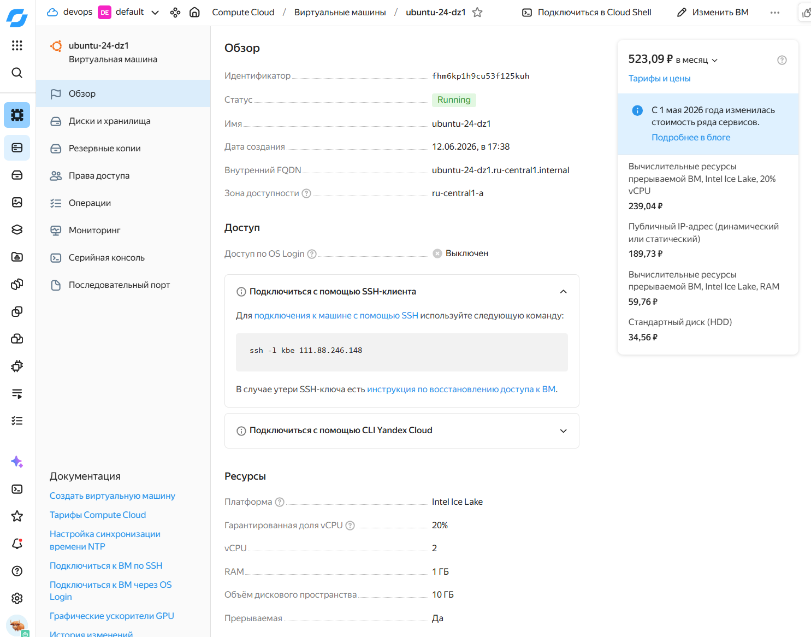

# Домашнее задание к занятию 1. «Введение в виртуализацию»

[virtd-homeworks/05-virt-01-basics at shvirtd-1 · netology-code/virtd-homeworks](https://github.com/netology-code/virtd-homeworks/tree/shvirtd-1/05-virt-01-basics)

### Задача 1

ssh -i .\.ssh\vps_ed25519 [kbe@111.88.246.148](mailto:kbe@111.88.246.148)

### Задача 2

**Высоконагруженная база данных MySql, критичная к отказу** — предпочтительнее выбирать кластерные решения на основе аппаратной или паравиртуализации. Это позволит обеспечить  балансировку нагрузки и отказоустойчивость. Bare metal выигрывает по скорости, но затруднит миграцию на другой сервер, обслуживание сервера несет риск простоя.

**Различные web-приложения** — типичная на сегодня картина запускать такие приложения в контейнерах OCI/LXC. Масштабирование и отказоустойчивость достигаются за счет оркестрации.

**Windows-системы для использования бухгалтерским отделом** — может использоваться как bare metal, так и паравиртуализация. Обычно такие системы не имеют неожиданных требований к масштабированию и допускают постепенный апгрейд с допустимым временем простоя в нерабочие часы.

**Системы, выполняющие высокопроизводительные расчёты на GPU** — в большинстве случает bare metal предпочтительнее и проще в настройке. Требования к надежности хранения данных обычно отсутствуют, поскольку storage обычно является отдельным сервером. Технически возможно прокидывать GPU в виртуальные машины. При нерегулярных вычислениях экономически выгоднее пользоваться облачными VM c GPU.

### Задача 3

| 100 виртуальных машин на базе Linux и Windows, общие задачи, нет особых требований. Преимущественно Windows based-инфраструктура, требуется реализация программных балансировщиков нагрузки, репликации данных и автоматизированного механизма создания резервных копий. | Подойдет виртуализация на основе Proxmox/KVM, XEN, VMware. Все указанные платформы имеют возможность распределения VM по кластеру и организации резервного копирования |
| --- | --- |
| Требуется наиболее производительное бесплатное open source-решение для виртуализации небольшой (20-30 серверов) инфраструктуры на базе Linux и Windows виртуальных машин. | Подойдет Proxmox/KVM, XEN - это типовая ниша для них |
| Необходимо бесплатное, максимально совместимое и производительное решение для виртуализации Windows-инфраструктуры | Можно начать с одного гипервизора ESXi, Hyper-V. Если ожидается последующее масштабирование лучше выбирать OpenSource (KVM, XEN) |
| Необходимо рабочее окружение для тестирования программного продукта на нескольких дистрибутивах Linux. | Если продукт не должен иметь специфических требований к дистрибутиву, можно рассмотреть его развертывание в контейнерах LXC/OCI.

Если есть привязка к дистрибутиву, можно создать шаблонные VM каждого дистрибутива для VirtualBox, QEMU и автоматизировать их пересоздание например через Vagrant. |

### Задача 4

> Опишите возможные проблемы и недостатки гетерогенной среды виртуализации (использования нескольких систем управления виртуализацией одновременно) и что необходимо сделать для минимизации этих рисков и проблем. Если бы у вас был выбор, создавали бы вы гетерогенную среду или нет?
> 

Главный недостаток — сложность миграции между серверами и неполное использование ресурсов (уплотнение, оптимизация сервисов)

Также увеличивает накладные расходы на поддержку (поиск специалистов, обучение). Повышаются требования к квалификации персонала, увеличивается вероятность ошибок.

В сфере ИБ — опасность появления legacy продуктов с уязвимостями.

Финансово выгоднее лицензироваться у одного вендора.