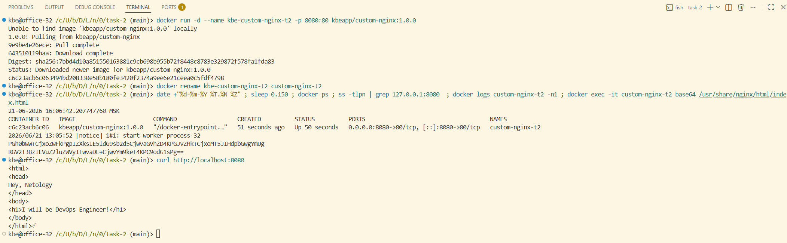
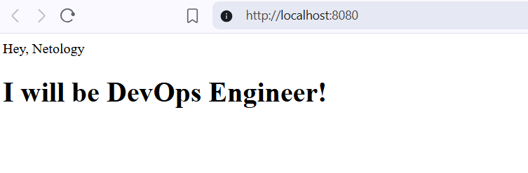

# Задача 2

```shell
docker run -d --rm --name kbe-custom-nginx-t2 -p 8080:80 kbeapp/custom-nginx:1.0.0
docker rename kbe-custom-nginx-t2 custom-nginx-t2

date +"%d-%m-%Y %T.%N %Z" ; sleep 0.150 ; docker ps ; ss -tlpn | grep 127.0.0.1:8080  ; docker logs custom-nginx-t2 -n1 ; docker exec -it custom-nginx-t2 base64 /usr/share/nginx/html/index.html

curl http://localhost:8080

docker rm -f tom-nginx-t2
```


---


