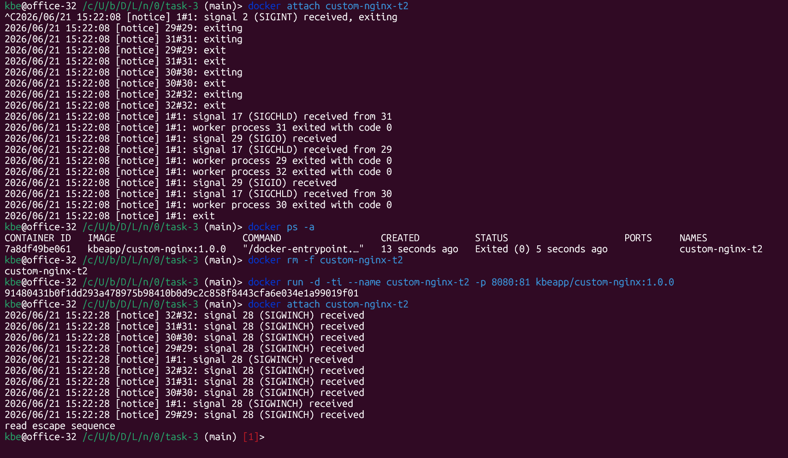
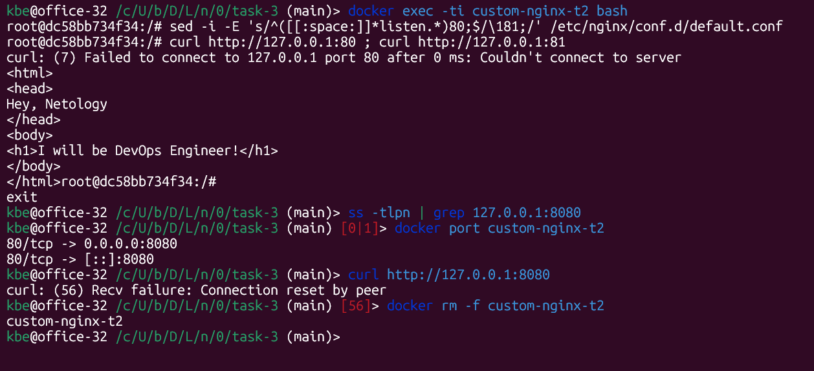

# Задача 3



```shell
# 1. подключение к STDIN/STDOUT
docker attach custom-nginx-t2

# 2. Ctrl-C

# 3. `docker attach` подключается к основному процессу контейнера и его STDIN, следовательно Ctrl-C завершает именно основной процесс, после чего контейнер прекращает работу
docker ps -a

# 4. перезапуск контейнера после Ctrl-C с аргументами -ti
docker rm -f custom-nginx-t2
docker run -d -ti --name custom-nginx-t2 -p 8080:81 kbeapp/custom-nginx:1.0.0

# 4.1 повторное подключение и выход graceful отключение
docker attach custom-nginx-t2
Ctrl+P
Ctrl+Q

# Последовательность Ctrl+P, затем Ctrl+Q позволяет отключиться от контейнера, не прекращая основной процесс, если контейнер запущен с аргументом `-ti`.
```


```shell
# 5. запускаем container shell
docker exec -ti custom-nginx-t2 bash

# 6-7. in-place правим конфиг nginx
sed -i -E 's/^([[:space:]]*listen.*)80;$/\181;/' /etc/nginx/conf.d/default.conf

# 8. перезапуск nginx и пробный запрос к nginx
nginx -s reload; curl http://127.0.0.1:80 ; curl http://127.0.0.1:81

# 9. Ctrl-D

# 10. Привязка портов `8080:80` задается на этапе запуска и не меняется автоматически впоследствии
ss -tlpn | grep 127.0.0.1:8080; docker port custom-nginx-t2; curl http://127.0.0.1:8080
```

## 11. Комментарии к правке измененного порта `81` контейнера 

В [статье](https://www.baeldung.com/linux/assign-port-docker-container) описаны такие способы:
* **Создание нового образа** (`docker commit`) из работающего контейнера:
    ```shell
    docker stop custom-nginx-t2
    docker commit custom-nginx-t2 custom-nginx:port-81
    docker run -d -ti --name custom-nginx-t2 -p 8080:81 custom-nginx:port-81
    ```
* **Правка metadata-конфигов** в `/var/lib/docker/containers`:
    Данный способ воспринимаю как грязный хак, поскольку потребуется перезапуска docker daemon с перезапуской других контейнеров.


* **Codex (ChatGPT 5.5)** предлагает ad-hoc неинвазивный способ проброса измененного порта контейнера `81` на временный внешний порт `8081`:

    ```shell
    docker inspect -f '{{range.NetworkSettings.Networks}}{{.IPAddress}}{{end}}'
    custom-nginx-t2
    sudo apt install socat
    socat TCP-LISTEN:8081,fork TCP:172.17.0.2:81 &
    curl http://localhost:8081
    killall socat
    ```
---

```shell
# 12. принудительное удаление контейнера
docker rm -f custom-nginx-t2
```

