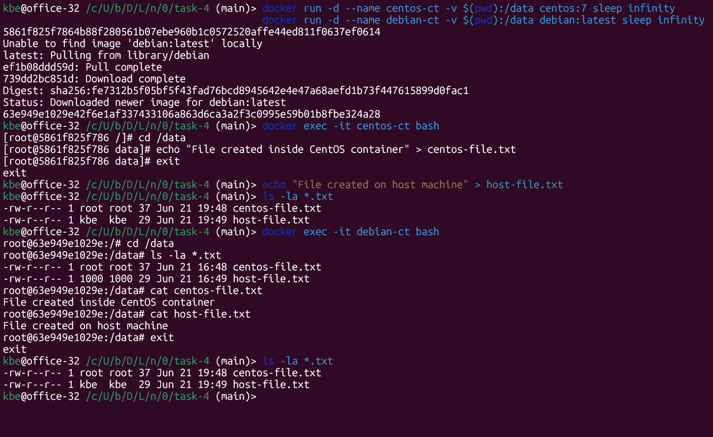

# Задача 4



```shell
# Запуск контейнеров с основным sleep процессом
docker run -d --name centos-ct -v $(pwd):/data centos:7 sleep infinity
docker run -d --name debian-ct -v $(pwd):/data debian:latest sleep infinity

# Подключение и создание файла в /data/ на первом контейнере `centos-ct`
docker exec -it centos-ct bash 
cd /data
echo "File created inside CentOS container" > centos-file.txt
exit

# Создание файла на хост-системе
echo "File created on host machine" > host-file.txt
ls -la *.txt

# Подключение и вывод листинга /data/ на втором контейнере `debian-ct`
docker exec -it debian-ct bash
cd /data
ls -la *.txt
cat centos-file.txt
cat host-file.txt
exit
```

