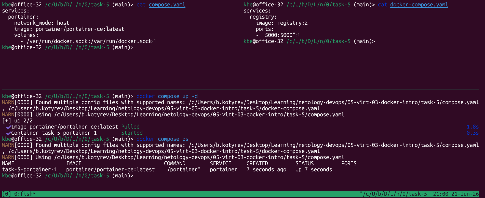

# Задание 5

# 1. Создание `compose.yaml` и `docker-compose.yaml`


```shell
docker compose -f compose.yaml up -d
docker compose -f compose.yaml ps

docker tag custom-nginx:latest 127.0.0.1:5000/custom-nginx:latest
docker push 127.0.0.1:5000/custom-nginx:latest
docker pull 127.0.0.1:5000/custom-nginx:latest

mv compose.yaml compose.yaml.bak
docker compose up -d
docker compose up -d --remove-orphans
docker compose down
```