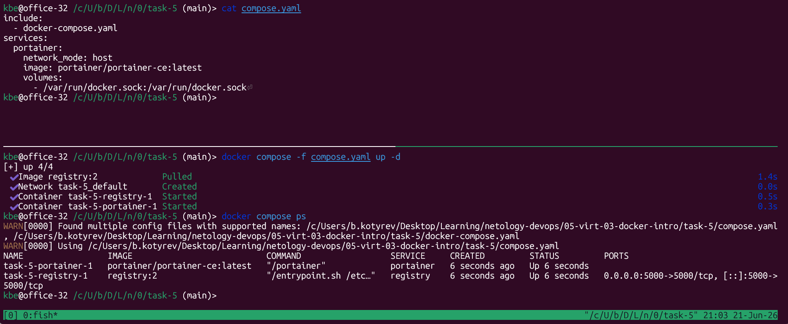
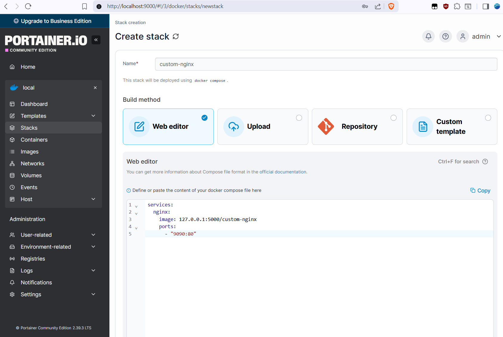
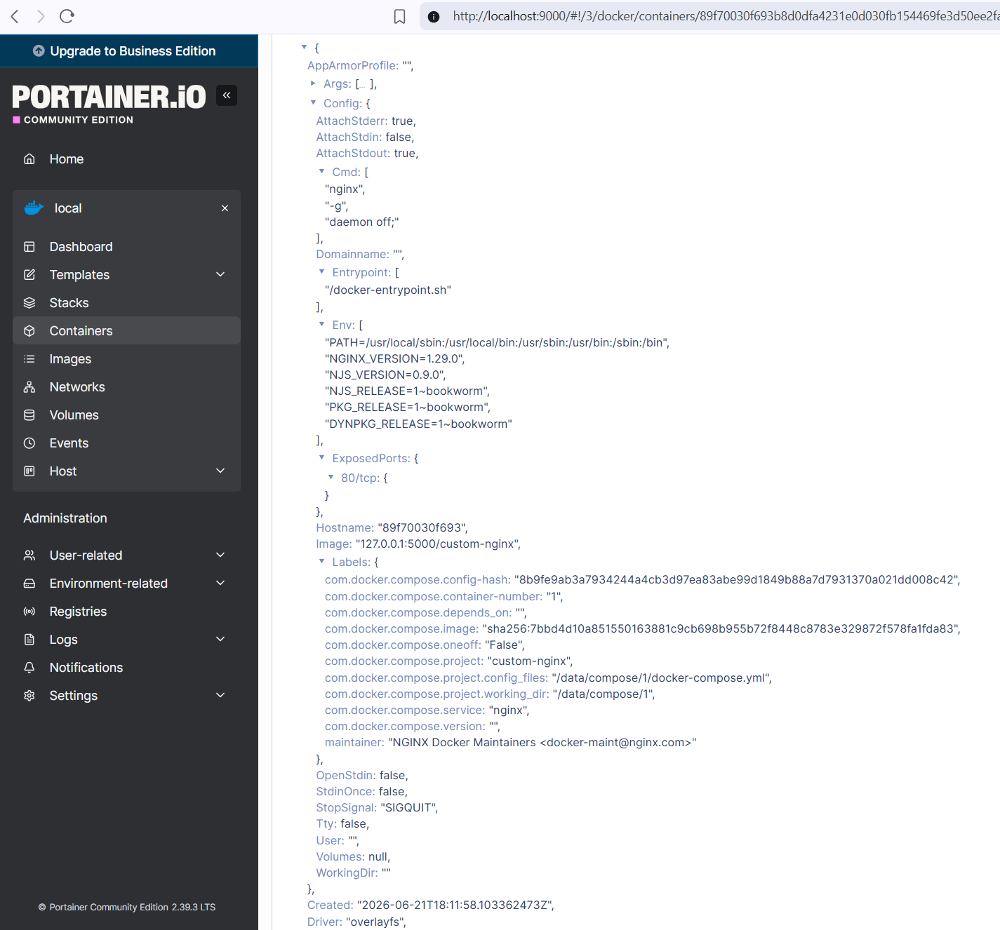

# Задание 5

## 1. Создание `compose.yaml` и `docker-compose.yaml`


Приоритет отдается имена compose.yaml/compose.yml, если не указывать -f. Поэтому при команде docker compose up -d в одной папке будет загружен только сервис `portainer`, хотя `docker compose` и выдает предупреждение, что нашёл оба конфига.

```shell
docker compose -d
docker compose ps
```

## 2. Compose Include



```shell
docker compose -f compose.yaml up -d
docker compose -f compose.yaml ps
```

## 3. Push образа `custom-nginx:latest` в локальное registry


```shell
docker tag kbeapp/custom-nginx:1.0.0 127.0.0.1:5000/custom-nginx:latest
docker push 127.0.0.1:5000/custom-nginx:latest
docker pull 127.0.0.1:5000/custom-nginx:latest
```

## 4. Настройка `Portainer`


## 5. Деплой `custom-nginx` в Portainer




```yaml
services:
  nginx:
    image: 127.0.0.1:5000/custom-nginx
    ports:
      - "9090:80"
```      

## 6. Inspect `custom-nginx` в Portainer




## 7. Удаление манифеста Compose

```shell
mv compose.yaml compose.yaml.bak
docker compose up -d
docker compose up -d --remove-orphans
docker compose down
```