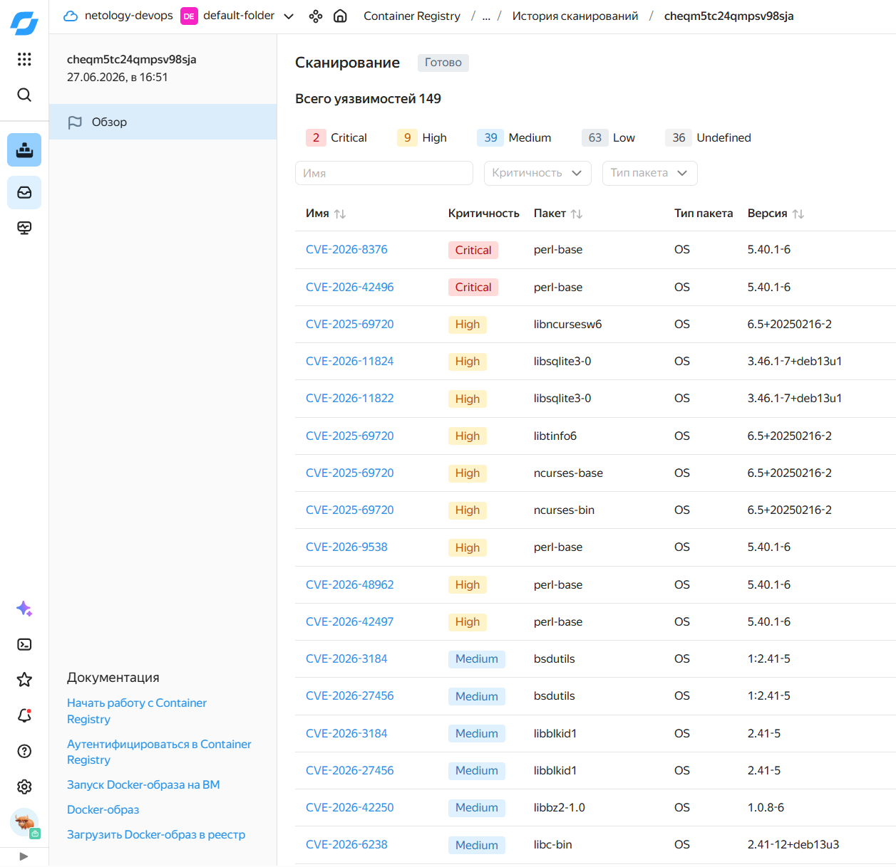

# Задача 2



```shell
# создаем yandex cloud container registry
yc container registry create --name test

# получение ID созданного реестра
yc container registry list

# настройка авторизации docker для Yandex Container Registry
yc container registry configure-docker

# сборка локального образа с тегом для Yandex Container Registry
docker build --no-cache -t cr.yandex/crp593kr8e6uor2mv4jc/shvirtd-example-python:task-2 -f Dockerfile.python 
docker image ls cr.yandex/crp593kr8e6uor2mv4jc/shvirtd-example-python:task-2

# push в YC
docker push cr.yandex/crp593kr8e6uor2mv4jc/shvirtd-example-python:task-2
yc container image list --registry-id crp593kr8e6uor2mv4jc

# сканирование на уязвимости и получения отчета в CLI
yc container image scan crpliehfjin9933k5asi
yc container image get-last-scan-result --image-id crpliehfjin9933k5asi
yc container image list-vulnerabilities --scan-result-id cheqm5tc24qmpsv98sja
```
