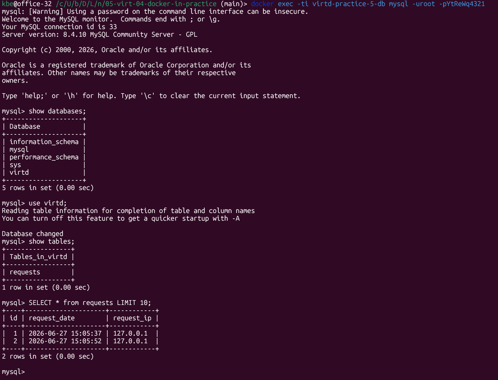

# Задача 3

## Примечание по Docker Desktop и WSL2

На Docker Desktop для Windows `network_mode: host` недоступен с Windows-хоста как `http://127.0.0.1:8090`, даже если nginx слушает порт внутри Docker host namespace. 

