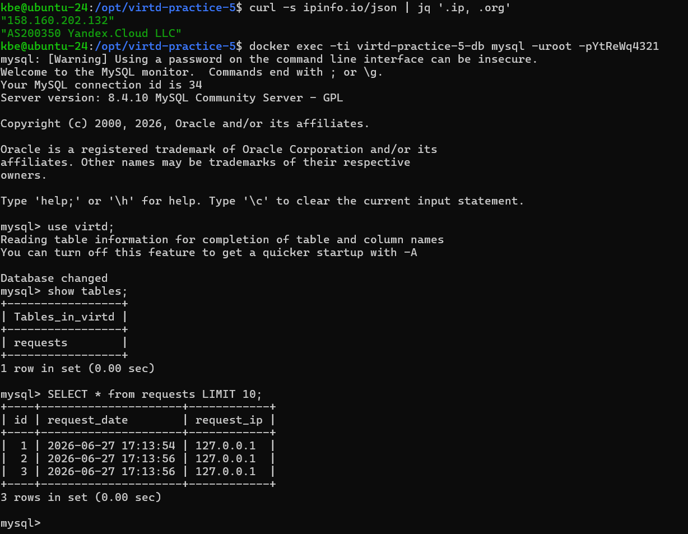
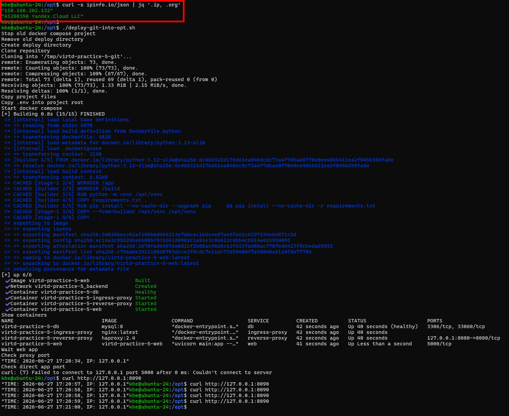

# Задача 4



## GitHub
[netology-devops bkotyrev](https://github.com/bkotyrev/netology-devops.git)

## bash-скрипт:

```text
task-4/deploy-git-into-opt.sh
```



Скрипт игнорирует `.env` из git, поскольку в настоящем репозитории не могут храниться чувствительные данные открытым текстом паролей и значений переменных окружения.

Вместо этого он ожидает, что `virtd-practice-5.env` будет находиться в одной папке со скриптом. `virtd-practice-5.env` копируется  как `.env` в папку деплоя.


