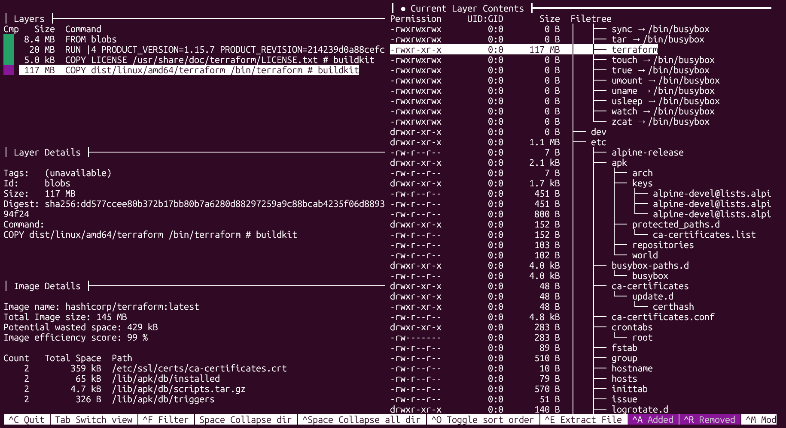
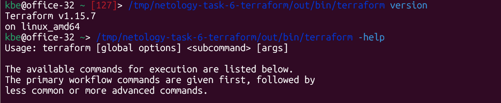

# Задача 6

Цель: скачать образ `hashicorp/terraform:latest`, изучить его через `dive` и извлечь бинарный файл `/bin/terraform` из сохраненного Docker-образа через `docker save`.

Команды выполнялись в Ubuntu 24 под WSL 2.

## Загрузка образа

```shell
docker pull hashicorp/terraform:latest
docker image inspect hashicorp/terraform:latest \
  --format 'ID={{.Id}} Size={{.Size}} Architecture={{.Architecture}} OS={{.Os}}'
```

## Находим слой с бинарником **terraform** через `dive`



```shell
docker run --rm -it \
           -v /var/run/docker.sock:/var/run/docker.sock \
           wagoodman/dive:latest \
           hashicorp/terraform:latest
```

## 3. Извлечение бинарника **terraform**  через `docker save`



```sh
WORK=/tmp/netology-task-6-terraform

mkdir -p "$WORK/image" "$WORK/out"
docker save hashicorp/terraform:latest -o "$WORK/image.tar"
tar -xf "$WORK/image.tar" -C "$WORK/image"
tar -xf "$WORK/image/blobs/sha256/e2ac9ac71baf2ba700d0db15093441daaaad60351b56875312364046c6f09485" -C "$WORK/out" bin/terraform

/tmp/netology-task-6-terraform/out/bin/terraform version
/tmp/netology-task-6-terraform/out/bin/terraform -help
```

