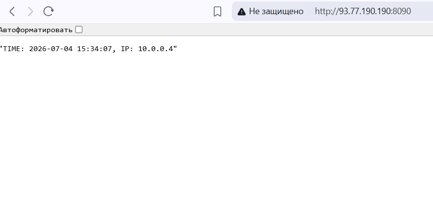
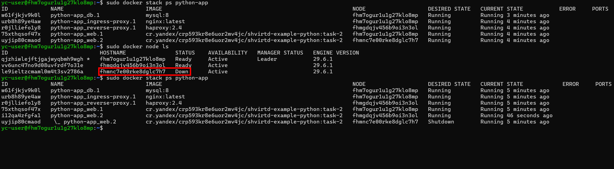

# Yandex.Cloud init

```powershell
yc compute instance create `
  --name master-01 `
  --hostname master-01 `
  --preemptible `
  --zone ru-central1-a `
  --cores 2 `
  --memory 2GB `
  --core-fraction 20 `
  --network-interface subnet-id=e9b8ltejajtcttvs9048,nat-ip-version=ipv4 `
  --create-boot-disk name=boot-master-01,type=network-hdd,size=20GB,image-name=ubuntu-24-docker,auto-delete=true `
  --ssh-key $env:USERPROFILE\.ssh\id_ed25519.pub

yc compute instance create `
  --name worker-01 `
  --hostname worker-01 `
  --preemptible `
  --zone ru-central1-a `
  --cores 2 `
  --memory 2GB `
  --core-fraction 20 `
  --network-interface subnet-id=e9b8ltejajtcttvs9048,nat-ip-version=ipv4 `
  --create-boot-disk name=boot-worker-01,type=network-hdd,size=20GB,image-name=ubuntu-24-docker,auto-delete=true `
  --ssh-key $env:USERPROFILE\.ssh\id_ed25519.pub  

yc compute instance create `
  --name worker-02 `
  --hostname worker-02 `
  --preemptible `
  --zone ru-central1-a `
  --cores 2 `
  --memory 2GB `
  --core-fraction 20 `
  --network-interface subnet-id=e9b8ltejajtcttvs9048,nat-ip-version=ipv4 `
  --create-boot-disk name=boot-worker-02,type=network-hdd,size=20GB,image-name=ubuntu-24-docker,auto-delete=true `
  --ssh-key $env:USERPROFILE\.ssh\id_ed25519.pub  

yc compute instance list 

ssh -i ".ssh\id_ed25519" yc-user@<IP-MASTER-01>
```

# Инициализация Docker Swarm на master-01

```shell
# получение IP (на manager node)
ip -br addr show eth0

# инициализация (на manager node)
sudo docker swarm init --advertise-addr 10.1.2.14
# будет получена строка подключения: docker swarm join --token SWMTKN-1-2ixe959p66pnxyrw9f2b2gindg97rjvmcek3bf6a7at3ico29w-2ztau17gf3hx8mn26pi0pj2a3 10.1.2.14:2377

# получение токенов (на manager node)
sudo docker swarm join-token -q manager
sudo docker swarm join-token -q worker

# добавление в кластер (на worker node)
ssh -i ".ssh\id_ed25519" yc-user@<IP-WORKER-NODE>
sudo docker swarm join --token SWMTKN-1-2ixe959p66pnxyrw9f2b2gindg97rjvmcek3bf6a7at3ico29w-2ztau17gf3hx8mn26pi0pj2a3 10.1.2.14:2377

# просмотр состава кластера (на manager node)
sudo docker node ls

# создание сервиса (на manager node)
sudo docker service create \
  --name web \
  --replicas 2 \
  --replicas-max-per-node 1 \
  -p 80:80 \
  nginx:alpine

# статус сервиса (на manager node)
sudo docker service ls

# статус сервиса (на manager node)
sudo docker service rm sic0e0izkpgk

# список стека микросервисов
sudo docker stack ls
```

# Развертывание python-app в Docker Swarm

- заменить `build` на готовый `image` из Yandex Container Registry;
- убрать `container_name`, `restart`, `include`, `network_mode: host`, `bridge`-сеть и статические IP;
- заменить `depends_on` с `condition: service_healthy` на Swarm-совместимую схему без `depends_on`;
- заменить bind mount конфигов прокси на `configs`;
- использовать `overlay`-сеть вместо `bridge`;
- настроить HAProxy и Nginx на DNS-имена сервисов Swarm;
- выполнить `docker stack deploy` с `--with-registry-auth`, чтобы воркеры смогли скачать приватный образ из `cr.yandex`.

## Файлы для Swarm
- `compose.yaml` - Swarm stack file;
- `haproxy/reverse/haproxy.cfg` - reverse proxy до сервиса `web`;
- `nginx/ingress/default.conf` - ingress proxy до сервиса `reverse-proxy`;
- `nginx/ingress/nginx.conf` - основной конфиг Nginx с log format `proxied`.

## Подготовка `.env` на manager

На manager node файл `/opt/virtd-practice-5/.env` должен содержать значения без внешних кавычек. Для MySQL нужны `MYSQL_*`, для FastAPI нужны `DB_*`.

```dotenv
MYSQL_ROOT_PASSWORD=<root-password>
MYSQL_DATABASE=virtd
MYSQL_USER=app
MYSQL_PASSWORD=<app-password>
DB_USER=app
DB_PASSWORD=<app-password>
DB_NAME=virtd
```

## Авторизация в Yandex Container Registry

Требуется авторизация по токену перед использованием registry:

```powershell
$token = yc iam create-token
$token | ssh -i "$env:USERPROFILE\.ssh\id_ed25519" yc-user@<IP-MASTER-01> `
  "sudo docker login --username iam --password-stdin cr.yandex"
```

## Итоговая команда успешного запуска стека

Ключевой флаг `--with-registry-auth` передает registry credentials из manager в Swarm service spec, чтобы worker-ноды могли скачать приватный образ.

Команда на manager node:

```bash
cd /opt/virtd-practice-5
sudo docker stack deploy --with-registry-auth --compose-file compose.yaml python-app
```





## Проверка 

```bash
sudo docker service ls
sudo docker stack ps python-app --no-trunc
sudo docker service logs --tail 80 python-app_web
curl http://127.0.0.1:8090
```
