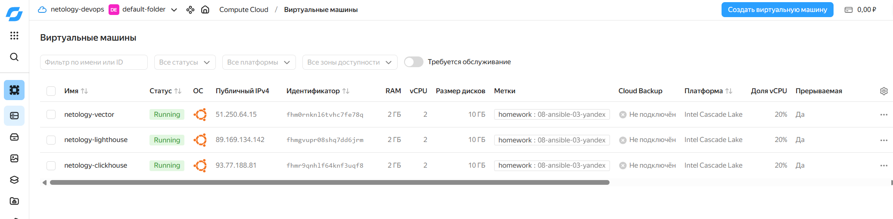

# Домашнее задание 08-ansible-03-yandex



- ClickHouse — база данных;
- Vector — агент обработки событий;
- LightHouse — статический интерфейс для ClickHouse, опубликованный через Nginx.

IAM-токен передаётся через переменную окружения `YC_IAM_TOKEN`

## Экспорт переменной окружения (в WSL иначе не заработало)

```bash
export ANSIBLE_CONFIG="$PWD/ansible.cfg"
```

## Создание инфраструктуры

```bash
ansible-playbook provision.yml
```

### ansible-lint

```bash
ansible-lint site.yml provision.yml
```

```text
Passed: 0 failure(s), 0 warning(s) in 10 files processed of 10 encountered.
Last profile that met the validation criteria was 'production'.
```

### Проверка playbook

```bash
ansible-playbook site.yml --check --diff
```

```text
netology-clickhouse : ok=3 changed=2 skipped=2 failed=0
netology-vector     : ok=1 changed=0 skipped=4 failed=0
netology-lighthouse : ok=1 changed=0 skipped=8 failed=0
```

```bash
ansible lighthouse -b -m command -a "systemctl is-active nginx"
ansible vector -b -m command -a "systemctl is-active vector"
ansible clickhouse -b -m command -a "systemctl is-active clickhouse-server"
```