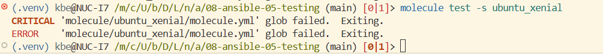

# Тестирование роли Vector

Два сценария Molecule:

- `default` — драйвер Docker, образы `ubuntu:latest` и `oraclelinux:8`;
- `compatibility` — облегчённый сценарий с драйвером Podman и образом `oraclelinux:8`.

## Настройка venv и зависимостей

```bash
python3 -m venv .venv
source .venv/bin/activate
python -m pip install -r requirements.txt
```

## Molecule

### 1. Проверка Xenial



### 2. Создание сценария

```bash
molecule init scenario default
```

### 3. Добавление oraclelinux:8, ubuntu:latest
[molecule/default/molecule.yml](molecule/default/molecule.yml)

```bash
molecule list
```

### 4. Добавление assert в verify.yml

[molecule/default/verify.yml](molecule/default/verify.yml)

### 5. Сценарий тестирования по умолчанию

```bash
molecule list
ANSIBLE_COLLECTIONS_SCAN_SYS_PATH=false molecule test -s default 
```
### Результат работы Molecule
[logs/molecule-default.log](logs/molecule-default.log)

## Запуск Tox

```bash
docker run --rm \
  --privileged=true \
  --cgroupns=host \
  -v /sys/fs/cgroup:/sys/fs/cgroup:rw \
  -v "$PWD:/opt/vector-role" \
  -w /opt/vector-role \
  -it aragast/netology:latest \
  /bin/bash

tox -r -e py39-ansible210
tox -r
```
### Результат работы Tox
[logs/tox-podman.log](logs/tox-podman.log)


