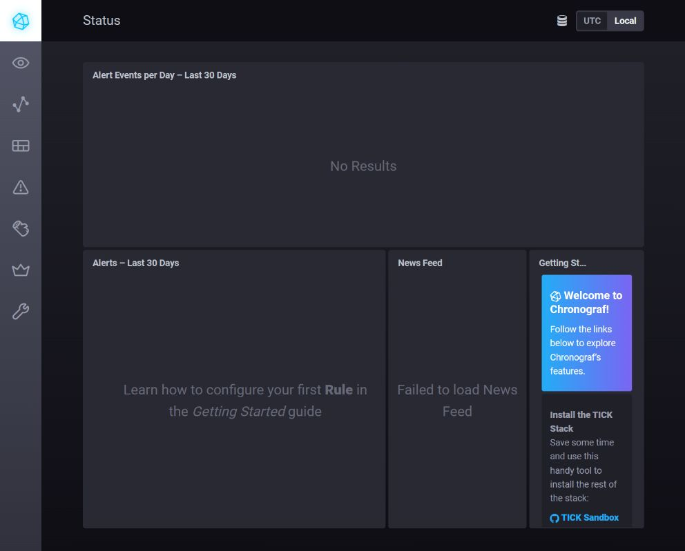
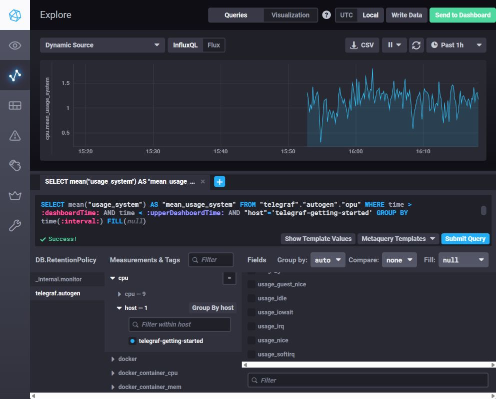
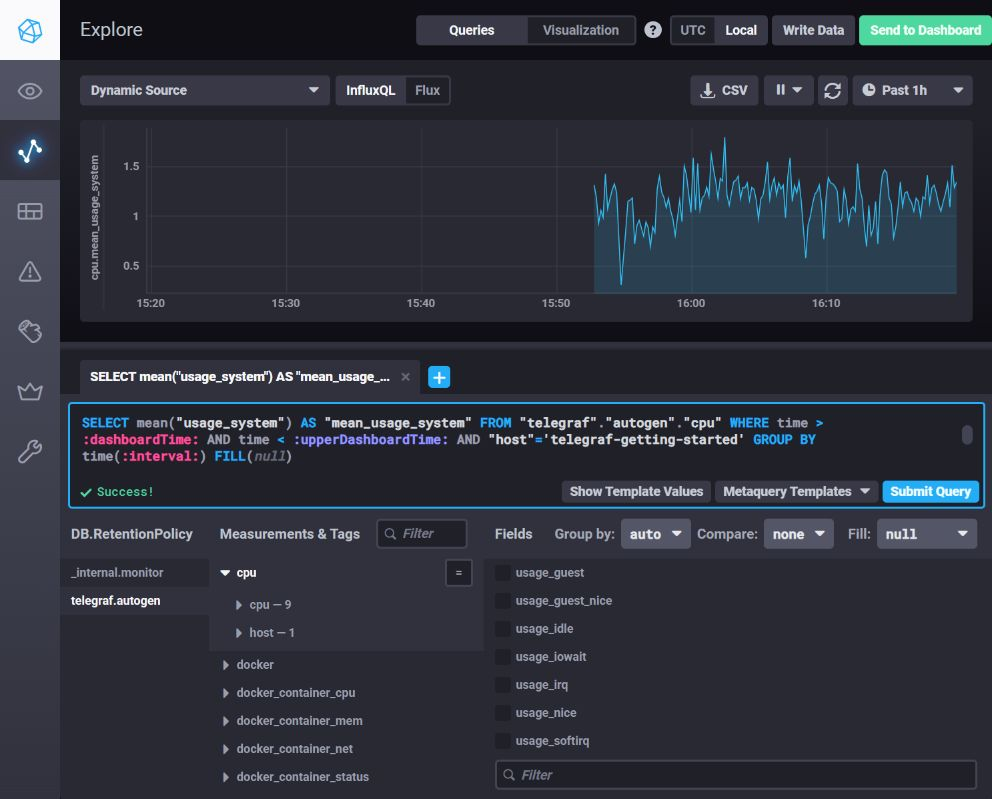
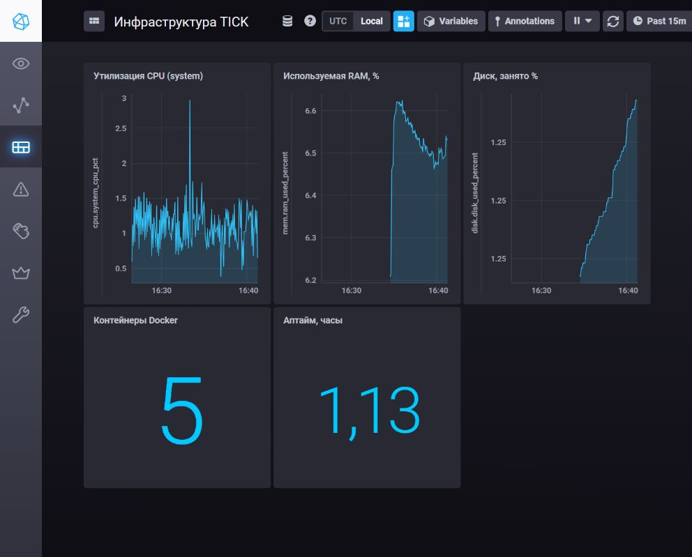

# Системы мониторинга

## 1. Минимальный набор метрик

Вероятно, я посоветовал бы использовать метрики:
 - HTTP: количество запросов, коды ответов, время ответа;
 - CPU: загрузку процессора и Load Average
 - DIsk/Storage: свободное место, inode и ошибки записи
 - RAM: процент использование памяти, "прожорливые" процессы, наличие событий OOM killer

## 2. Показатели продукта и качества обслуживания

Менеджеру будет проще оперировать понятиями SLI/SLO/SLA: доступность сервиса, процент успешных запросов, время ответа, успешность и время формирования отчётов. Будет полезен отдельный дашборд с этими показателями и понятными формулировками ("не менее 99 % успешных запросов за 30 дней").

## 3. Ошибки приложений  логов

Имеет смысл подключить отдельный инструмент для отслеживания ошибок, например Sentry или его open-source аналог. Приложение сможет отправлять туда исключения и stack trace напрямую, поэтому разработчики будут видеть ошибки без построения полноценной системы централизованного сбора логов

## 4. Расчёт SLA по HTTP-кодам

Скорее всего, не учтены HTTP-коды 1xx и 3xx. Если 5xx и 4xx отсутствуют, но доля 2xx составляет только 70%, оставшиеся ответы могут быть например редиректами 3xx. По распределению кодов можно попытаться определить, какие ответы сервиса считаются успешными и потом рассчитать SLA.

## 5. Pull- и push-модели

- **Pull**
  - Преимущества: централизованный контроль сбора, простой контроль доступности целей и auto-discovery.
  - Ограничения: сборщику нужен сетевой доступ к каждой цели; интервальный опрос создаёт задержку до обнаружения события.

- **Push**
  - Преимущества: подходит для целей за NAT, краткоживущих задач и немедленной передачи событий.
  - Ограничения: сложнее аутентификация, контроль источников, защита от потери данных и буферизация при недоступности приёмника.

## 6. Модели систем мониторинга

- **Prometheus - pull.** Основной способ - scrape; Pushgateway применяется для отдельных batch-задач.
- **TICK - push.** Telegraf отправляет метрики в InfluxDB.
- **Zabbix - гибрид.** Passive checks работают как pull, active checks и trapper - как push.
- **VictoriaMetrics - гибрид.** Поддерживаются pull через vmagent и push через `remote_write`/import.
- **Nagios - преимущественно pull.** Active checks дополняются passive checks, принимаемыми как push.

## 7. Развёртывание TICK-стека

Развернуто в папке `influxdata-sandbox`. Chronograf доступен по адресу `http://localhost:8888`.



## 8. Утилизация CPU в Data Explorer

В Data Explorer выбран источник `telegraf.autogen`, measurement `cpu`, тег `host = telegraf-getting-started` и поле `usage_system`. Для агрегации выбран `mean`, группировка задана автоматически по интервалу отображения, период наблюдения - последний час.

```sql
SELECT mean("usage_system") AS "mean_usage_system"
FROM "telegraf"."autogen"."cpu"
WHERE time > :dashboardTime:
  AND time < :upperDashboardTime:
  AND "host" = 'telegraf-getting-started'
GROUP BY time(:interval:) FILL(null)
```



## 9. Сбор Docker-метрик

В конфигурацию Telegraf добавлен input Docker:

```toml
[[inputs.docker]]
  endpoint = "unix:///var/run/docker.sock"
```

Контейнеру предоставлен доступ к Docker API через сокет. Для Docker Desktop процесс Telegraf запущен с группой `root`, которой принадлежит сокет:

```yaml
telegraf:
  user: "telegraf:root"
  volumes:
    - /var/run/docker.sock:/var/run/docker.sock
```

После изменения конфигурации выполнен перезапуск:

```bash
docker compose restart telegraf
```

После обновления Chronograf в `telegraf.autogen` присутствуют measurements `docker`, `docker_container_cpu`, `docker_container_mem`, `docker_container_net` и `docker_container_status`.



## Доп. задание (только Dashboard)

Создан dashboard `Инфраструктура TICK`. Источник данных - `telegraf.autogen`.

Дополнительные inputs:

```toml
[[inputs.mem]]
[[inputs.disk]]
```

Dashboard содержит:

- утилизацию CPU в системном режиме: `mean("usage_system")` из `cpu`;
- использованную RAM в процентах: `mean("used_percent")` из `mem`;
- занятое место на корневой файловой системе: `mean("used_percent")` из `disk` с фильтром `path = '/'`;
- число запущенных контейнеров: `max("n_containers_running")` из `docker`;
- аптайм хоста в часах: `max("uptime") / 3600` из `system`.


