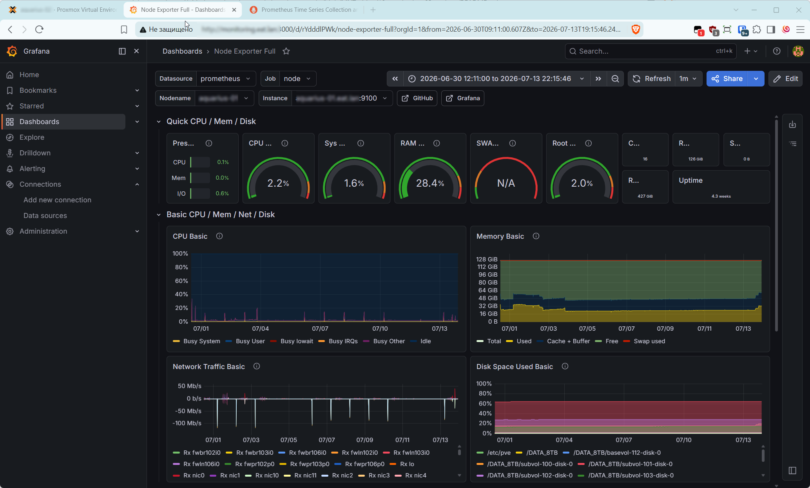
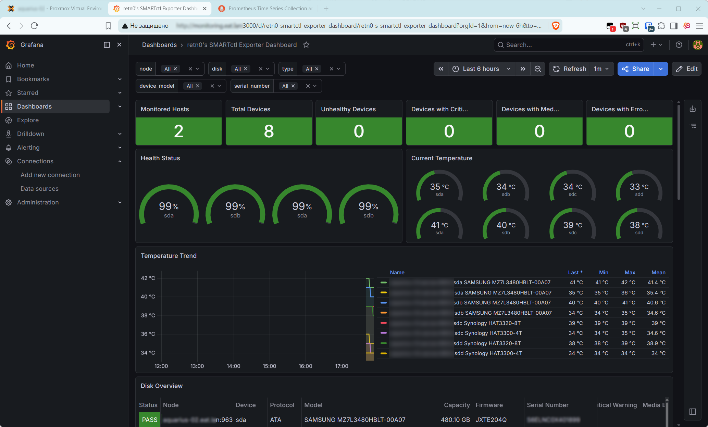
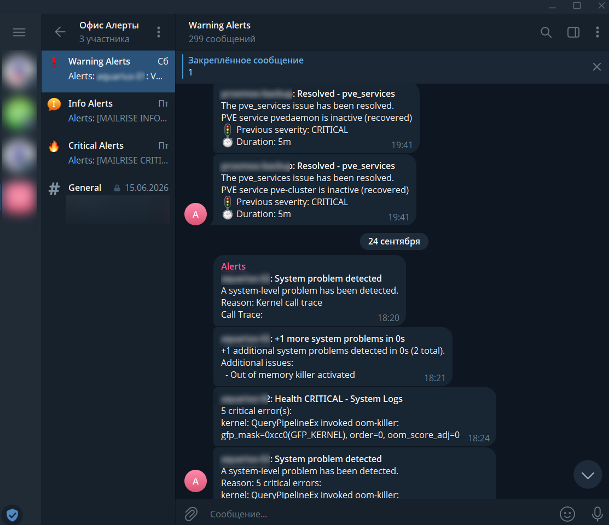

# Grafana. Дополнительное задание

В качестве задания я взял работающий стек с офисного сервера (с обезличенными данными).

Grafana, Prometheus и Alertmanager развернуты через Docker Compose в `/opt/monitoring` под гипервизором Proxmox.

Node Exporter работает на отдельном сервере как служба systemd.

Схема сбора и оповещений:

```text
Node Exporter :9100 ----> Prometheus :9090 ----> Grafana :3000
SMARTctl Exporter :9633 ->      |
                               +----> Alertmanager :9093 ----> Telegram
```

### Конфигурации

Обезличенные копии рабочих  файлов:

- [Docker Compose](additional-configs/docker-compose.yml).
- [Prometheus](additional-configs/prometheus/prometheus.yml).
- [Правила Node Exporter](additional-configs/prometheus/rules/node_exporter.yml).
- [Правила SMARTctl Exporter](additional-configs/prometheus/rules/smartctl_exporter.yml).
- [Правила ZFS](additional-configs/prometheus/rules/zfs-alerts.yml).
- [Alertmanager и Telegram](additional-configs/alertmanager/alertmanager.yml).
- [Служба Node Exporter](additional-configs/node-exporter/prometheus-node-exporter.service).
- [Параметры Node Exporter](additional-configs/node-exporter/prometheus-node-exporter.default).

### Дашборды

Используются Node Exporter Full и SMARTctl Exporter Dashboard. На скриншотах отображаются загрузка CPU, память, сеть, файловые системы, состояние и температура накопителей.





## Задание 3. Оповещения в Telegram

Правила вычисляются в Prometheus. Alertmanager группирует события по `alertname`, `instance` и `severity`, затем направляет их в темы Telegram по уровням `info`, `warning` и `critical`.

Основные правила:

| Событие | Условие | Выдержка |
| --- | --- | --- |
| Node Exporter недоступен | `up{job="node"} == 0` | 2 минуты |
| Высокая загрузка CPU | Более 85% / 95% | 10 / 5 минут |
| Высокий Load Average | LA 15 на один CPU выше 1.5 | 15 минут |
| Нехватка RAM | Доступно менее 20% / 10% | 10 / 5 минут |
| Нехватка места | Доступно менее 20% / 10% | 10 / 5 минут |
| OOM kill | Рост счетчика за 30 минут | Без выдержки |
| Температура диска | Более 60 / 70 градусов | 5 / 2 минуты |
| ZFS pool недоступен | Состояние online не равно 1 | 2 минуты |

На скриншоте приведены ранее полученные сообщения в Telegram. Отдельная тестовая отправка через Alertmanager не выполнялась.


