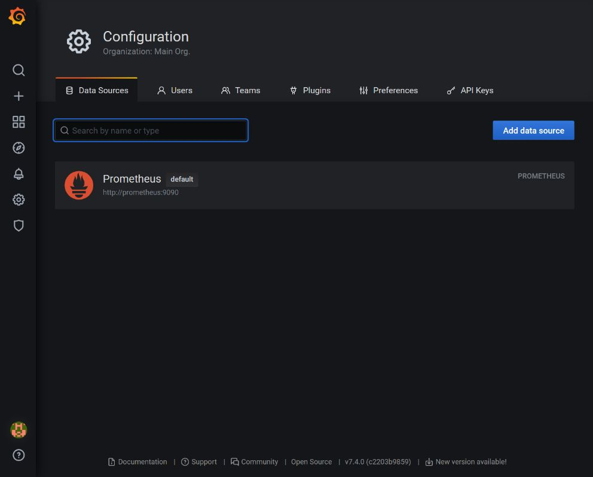
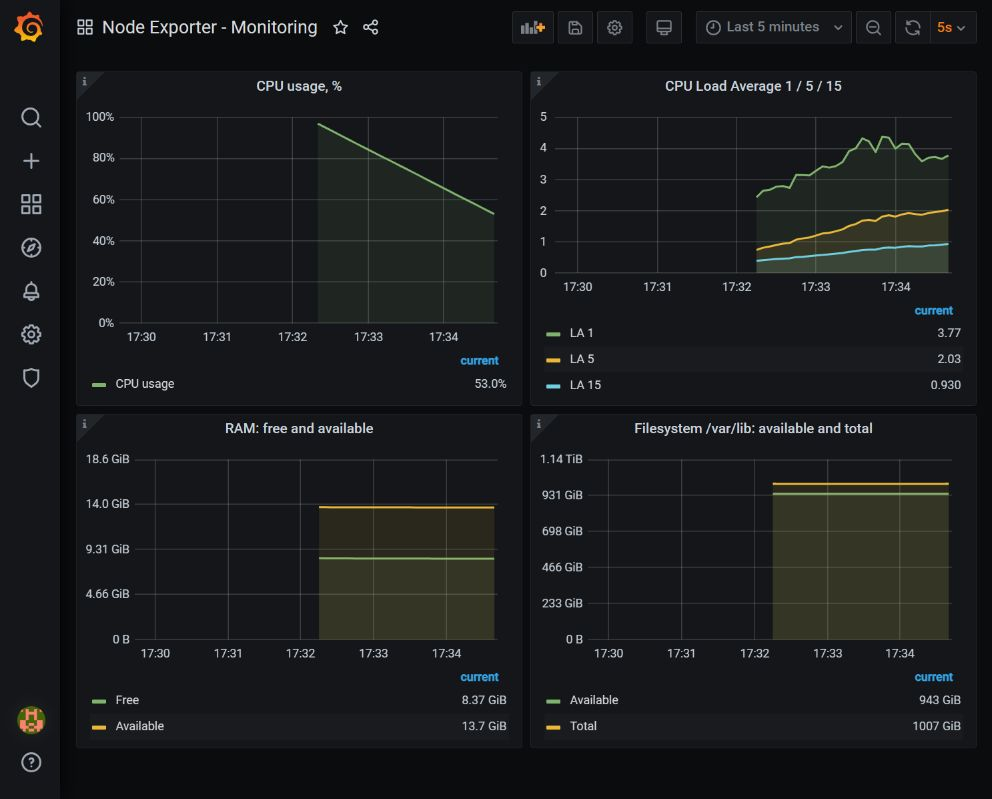
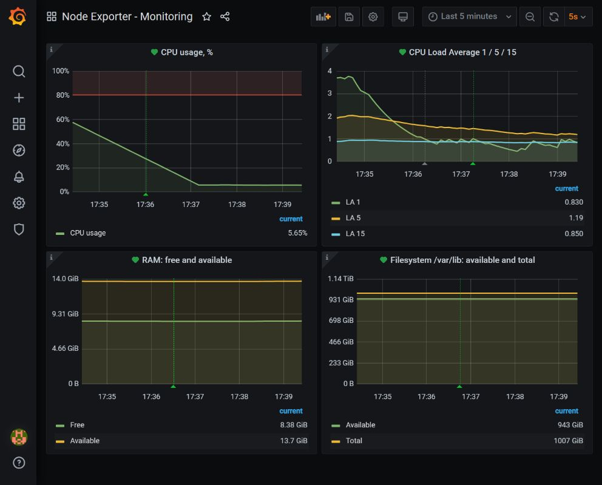
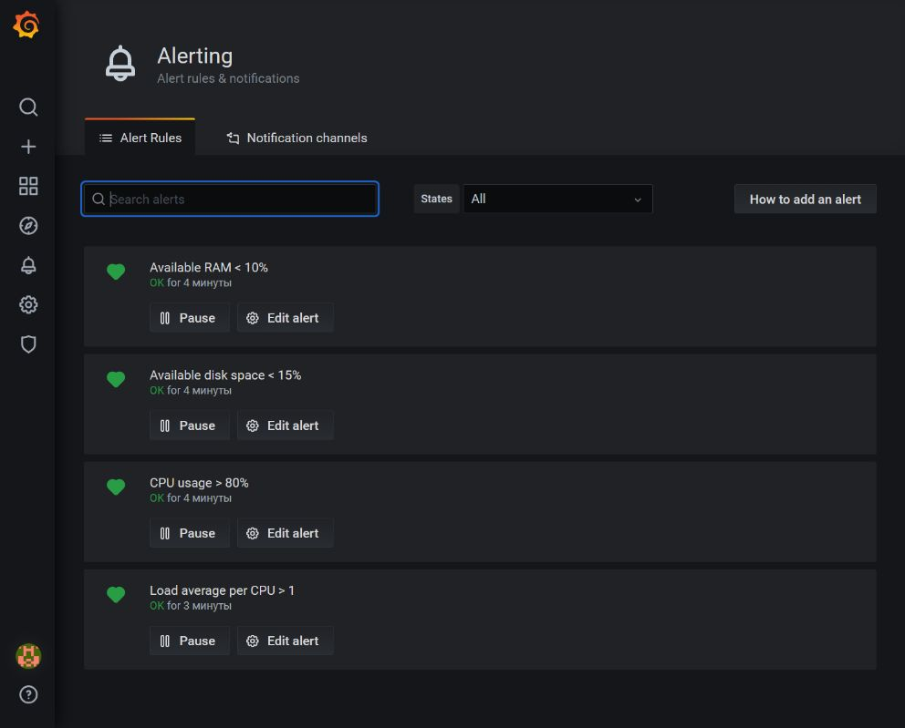

# Средство визуализации Grafana

## Задание 1. Источник данных

Стенд развернут из (https://github.com/netology-code/mnt-homeworks/tree/MNT-video/10-monitoring-03-grafana/help).

```bash
docker compose -p grafana-homework -f help/docker-compose.yml up -d
```

Подключен источник `Prometheus`: URL `http://prometheus:9090`, Access `Server`, интервал сбора `5s`.



## Задание 2.

Создан дашборд `Node Exporter - Monitoring`. 

Утилизация CPU, 100 минус средний idle по ядрам:

```promql
100 * (1 - avg by (instance) (
  rate(node_cpu_seconds_total{job="nodeexporter",mode="idle"}[5m])
))
```

Load Average за 1, 5 и 15 минут:

```promql
node_load1{job="nodeexporter"}
node_load5{job="nodeexporter"}
node_load15{job="nodeexporter"}
```

Свободная и доступная оперативная память:

```promql
node_memory_MemFree_bytes{job="nodeexporter"}
node_memory_MemAvailable_bytes{job="nodeexporter"}
```

Доступное место и общий размер файловой системы:

```promql
node_filesystem_avail_bytes{job="nodeexporter",mountpoint="/var/lib",fstype="ext4"}
node_filesystem_size_bytes{job="nodeexporter",mountpoint="/var/lib",fstype="ext4"}
```

Выбрана файловая система ext4, смонтированная в `/var/lib` и используемая для данных Docker Desktop. `avail` показывает место, доступное непривилегированным процессам. Единица отображения: GiB/TiB.



## Задание 3.

Для каждой панели создано правило. Проверка выполняется раз в минуту. Используется последнее значение запроса за 5 минут, условие должно сохраняться 5 минут.

| Панель | Условие |
| --- | --- |
| CPU | Утилизация выше 80% |
| Load Average | LA 5 на один логический CPU выше 1 |
| RAM | Доступно менее 10% памяти |
| Файловая система | Доступно менее 15% места |

Для CPU используется запрос панели. Остальные правила используют отдельные скрытые запросы:

```promql
node_load5{job="nodeexporter"}
/ on (instance)
count by (instance) (node_cpu_seconds_total{job="nodeexporter",mode="idle"})
```

```promql
100 * node_memory_MemAvailable_bytes{job="nodeexporter"}
/ node_memory_MemTotal_bytes{job="nodeexporter"}
```

```promql
100 * node_filesystem_avail_bytes{job="nodeexporter",mountpoint="/var/lib",fstype="ext4"}
/ node_filesystem_size_bytes{job="nodeexporter",mountpoint="/var/lib",fstype="ext4"}
```

При отсутствии данных устанавливается состояние `No Data`, при ошибке вычисления - `Alerting`. Проверка вычисления всех четырех правил завершена без ошибок. На момент проверки состояние правил: `OK`.





## Задание 4.

Модель из `Settings > JSON Model` сохранена в [dashboard.json](dashboard.json).
