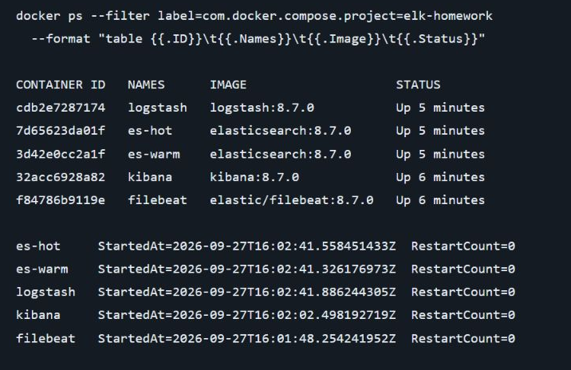
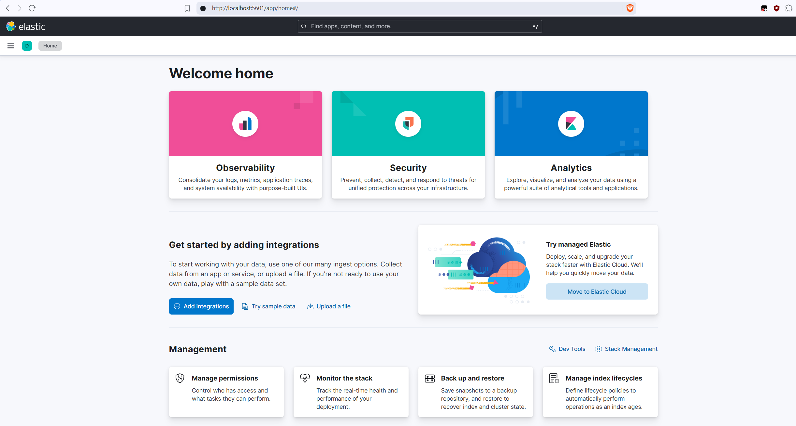
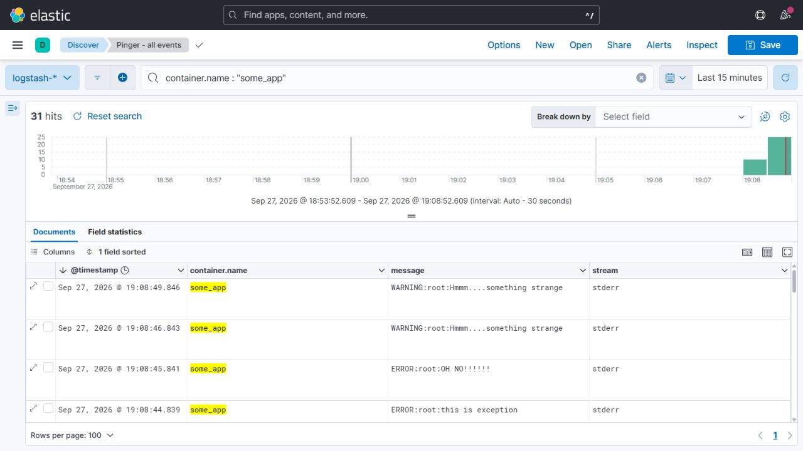
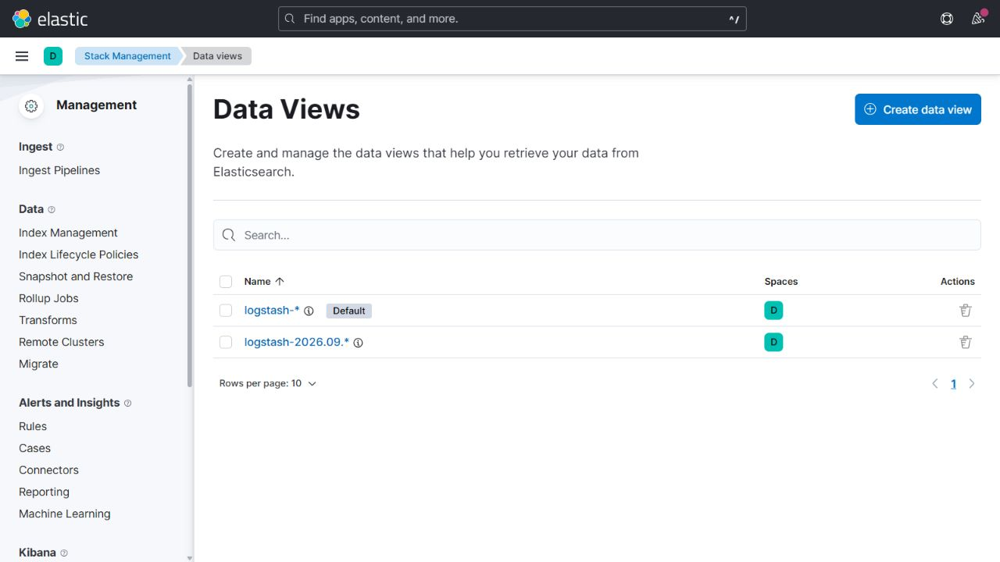
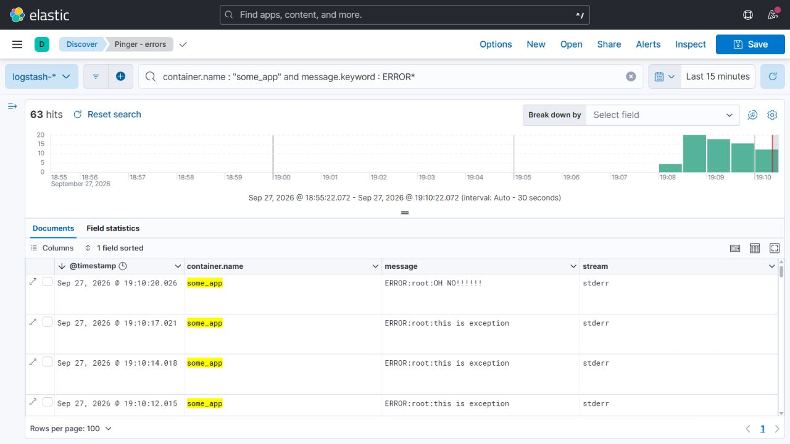

# Система сбора логов Elastic Stack

## Задание 1

| Контейнер | Назначение |
| --- | --- |
| `es-hot` | Elasticsearch: роли `master`, `data_content`, `data_hot` |
| `es-warm` | Elasticsearch: роли `master`, `data_warm` |
| `logstash` | Приём Beats на `5046` и JSON по TCP на `5044` |
| `kibana` | Просмотр индексов и поиск логов, `http://localhost:5601` |
| `filebeat` | Чтение Docker-логов и отправка в Logstash |

Схема передачи событий:

```text
Docker json-file → Filebeat → Logstash:5046 (Beats) → Elasticsearch → Kibana
JSON + перевод строки → Logstash:5044 (TCP/json_lines) → Elasticsearch
```



Исходный [вывод команд](evidence/docker-ps.txt) и [состояния контейнеров](evidence/containers.json) сохранены отдельно.

Интерфейс Kibana:




## Задание 2

В **Stack Management → Data Views** после запуска скрипта появились два index pattern с полем времени `@timestamp`



| Представление | Назначение |
| --- | --- |
| `logstash-*` | Все индексы логов; представление по умолчанию |
| `logstash-2026.09.*` | Индексы за сентябрь 2026 года |



В **Discover** представление `logstash-*`, период `Last 15 minutes`, сортировка по `@timestamp` от новых событий к старым. Добавлены столбцы `container.name`, `message`, `stream`.

### Поиск событий генератора:

```kql
container.name : "some_app"
```

### Поиск ошибок по префиксу исходной строки:

```kql
container.name : "some_app" and message.keyword : ERROR*
```



Cообщения `WARNING:root:Hmmm....something strange`, `ERROR:root:OH NO!!!!!!` и `ERROR:root:this is exception` видны в Kibana.

Представления и поиски `Pinger - all events`, `Pinger - errors` экспортированы в [kibana-saved-objects.ndjson](kibana-saved-objects.ndjson). Импорт доступен через **Stack Management → Saved Objects → Import**.
