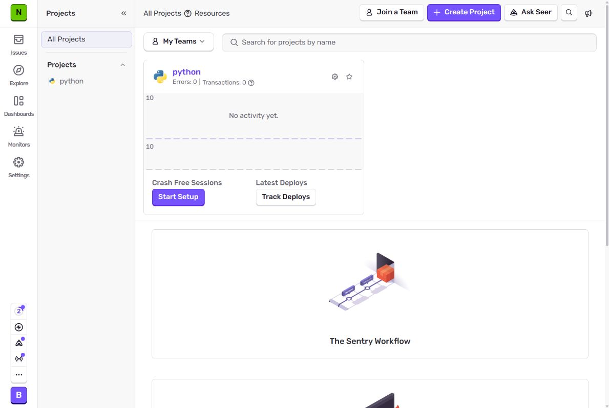
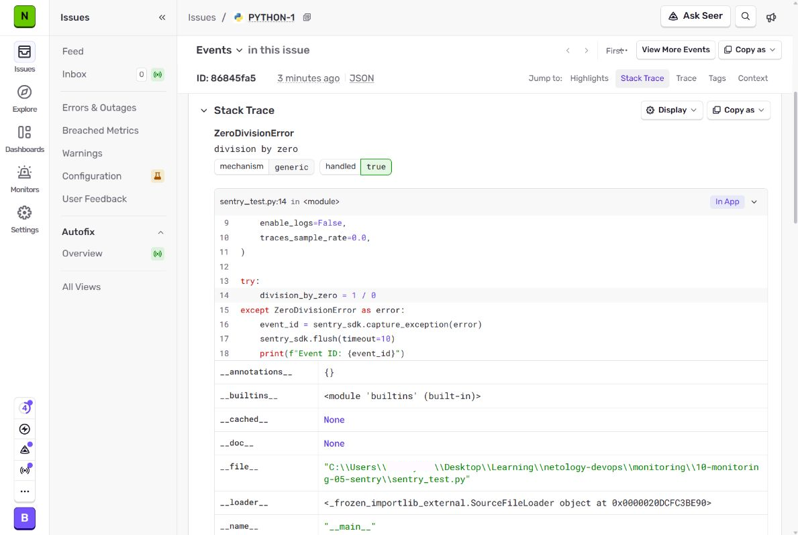
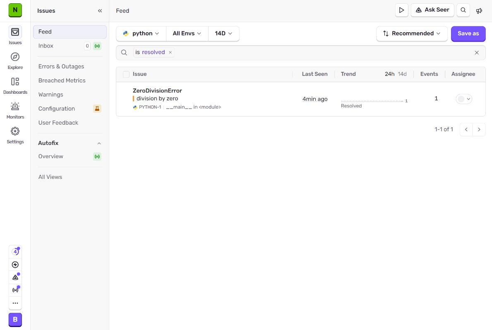
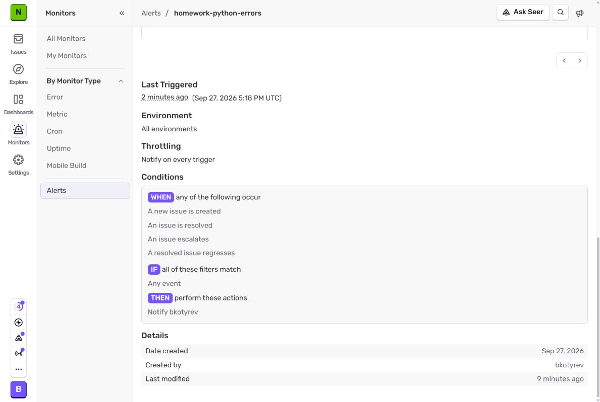
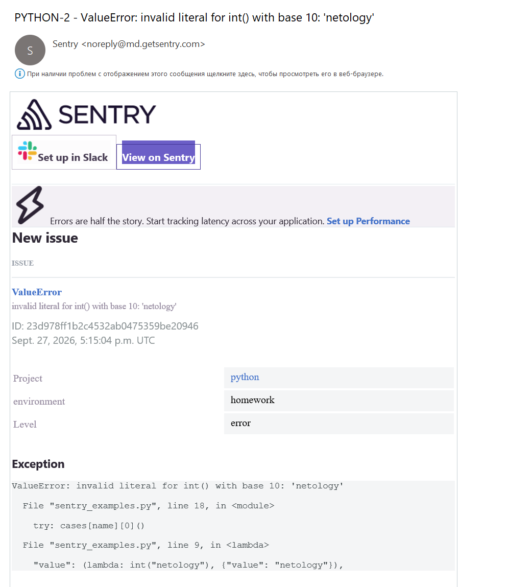
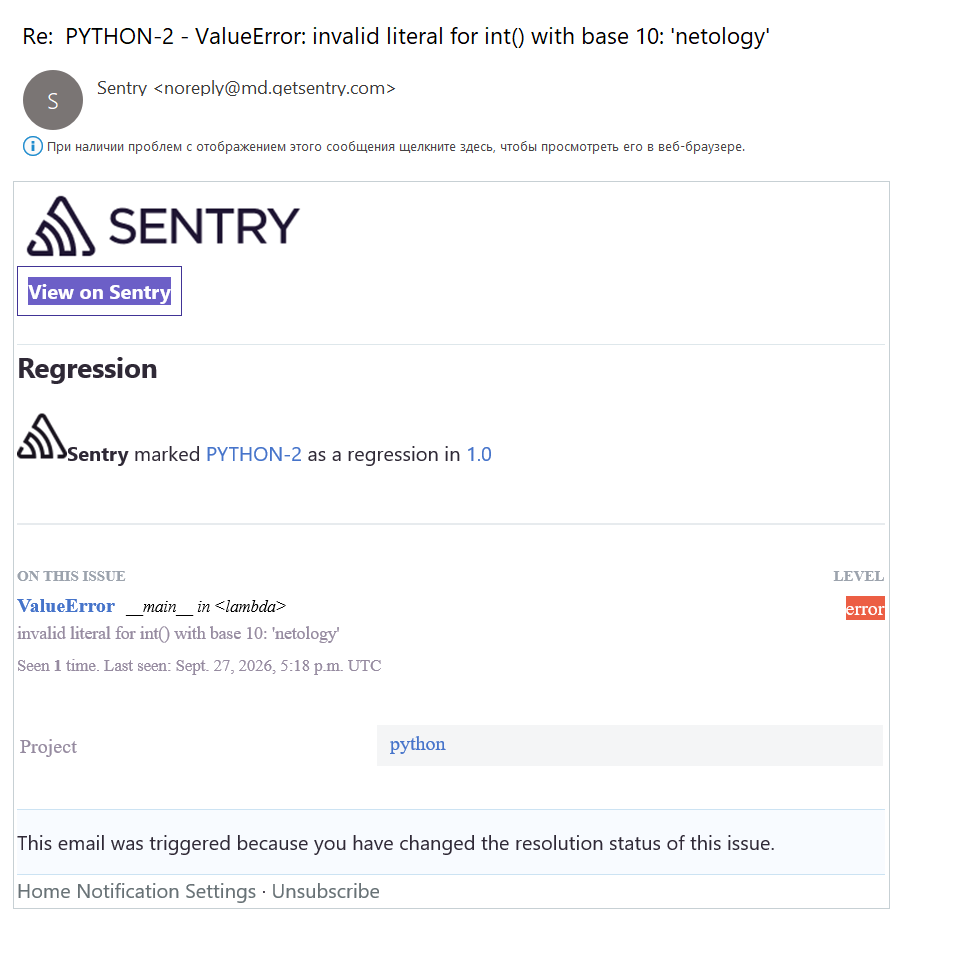
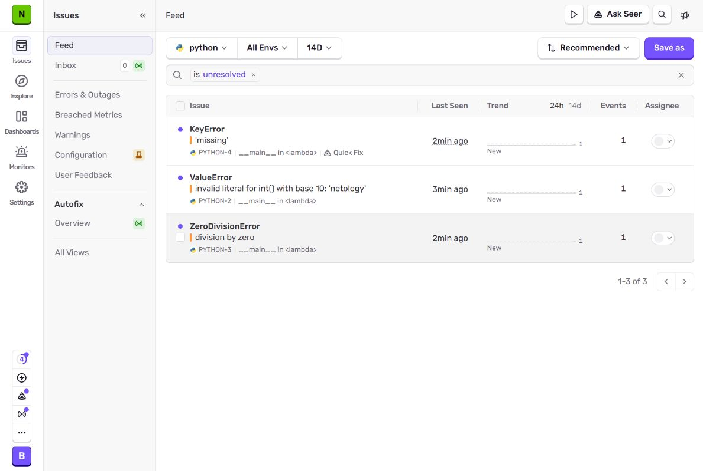

# Платформа мониторинга Sentry

## Задание 1

Создан проект типа `Python`.



## Задание 2

В текущем интерфейсе проекта отсутствует кнопка `Generate sample event`.

На сайте теперь предлагается намеренно вызвать ошибку `division_by_zero = 1 / 0`. Тестовое событие отправлено через Python SDK.

Скрипт [sentry_test.py](python/sentry_test.py) передаёт исключение методом `capture_exception()` и завершает отправку вызовом `flush()`.



Issue переведён в состояние **Resolved**. Список отфильтрован по `is:resolved`.



## Задание 3

Создано правило `homework-python-errors` для проекта `python` через **Monitors → Alerts**.

| Параметр | Значение |
| --- | --- |
| Проект | `python` |
| Окружение | All Environments |
| Условия | New issue, resolved issue, escalated issue, regressed issue |
| Фильтры | Any event |
| Действие | Notify on preferred channel → Member → `bkotyrev` |
| Частота | Notify on every trigger |
| Канал | Email |



Для проверки отправлена `ValueError: invalid literal for int() with base 10: 'netology'`. Получено письмо для issue `PYTHON-2`; проект и окружение соответствуют событию.



Создано экспериментальное правило `homework-python-regression` с условием `A resolved issue regresses` и фильтром `scenario equals value`. После перевода `PYTHON-2` в Resolved повторный запуск сценария изменил статус issue на **Regressed**. Правило сработало и после проверки отключено.



## Задание повышенной сложности

Скрипт [sentry_examples.py](python/sentry_examples.py) отправляет исключения `ZeroDivisionError`, `ValueError` и `KeyError`. Сценарий выбирается аргументом `zero`, `value`, `key` или `all`. Для каждого события задаются тег `scenario`, контекст `test_input`, окружение `homework` и release `sentry-homework@1.0`.

| Сценарий | Операция | Контекст | Issue |
| --- | --- | --- | --- |
| `zero` | `1 / 0` | `divisor: 0` | `PYTHON-3`, ZeroDivisionError |
| `value` | `int("netology")` | `value: netology` | `PYTHON-2`, ValueError |
| `key` | `{}["missing"]` | `key: missing` | `PYTHON-4`, KeyError |



## Запуск

DSN передаётся через переменную окружения.

```shell
cd python
python -m venv .venv

.\.venv\Scripts\python -m pip install -r requirements.txt
SENTRY_DSN='<DSN проекта python из Configure SDK>'
export $SENTRY_DSN

.\.venv\Scripts\python sentry_test.py
.\.venv\Scripts\python sentry_examples.py all
```
