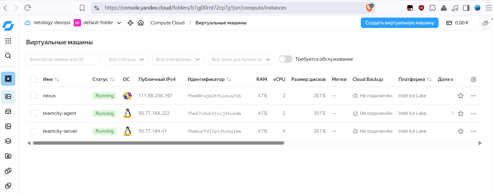
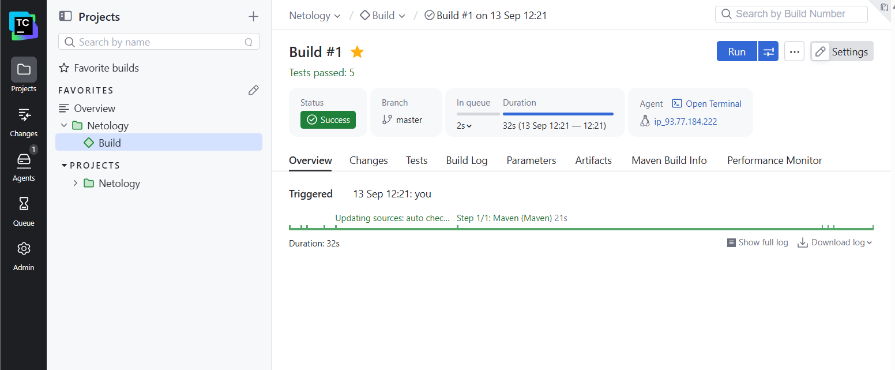
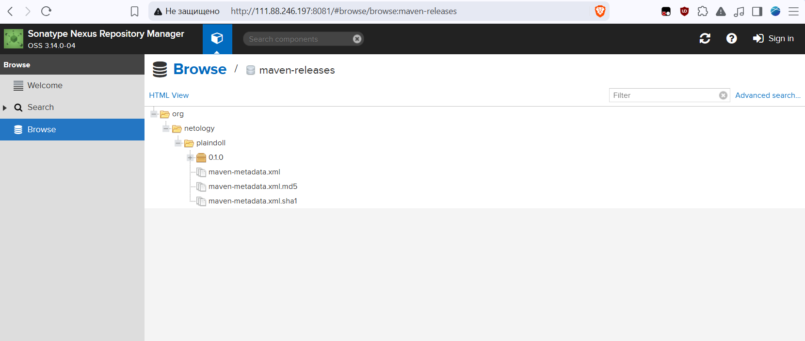
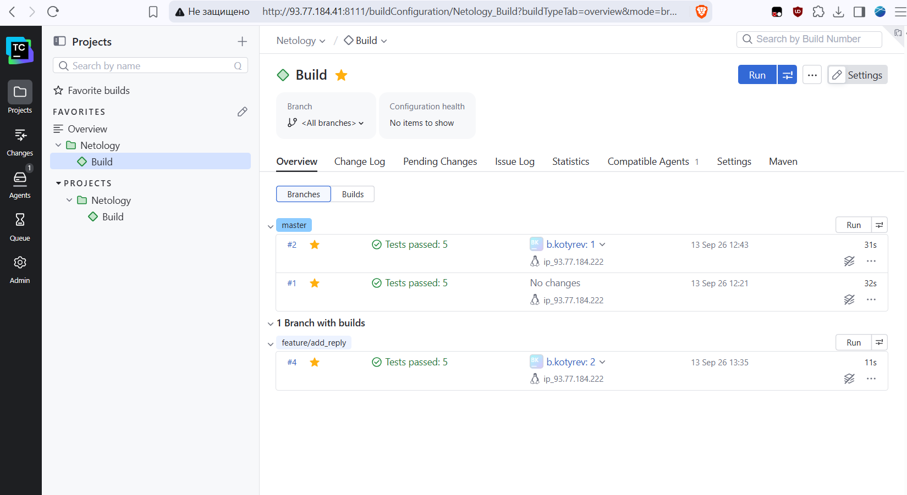
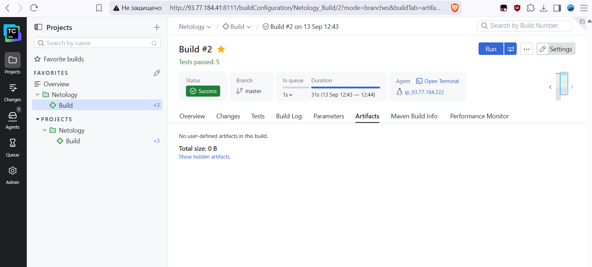
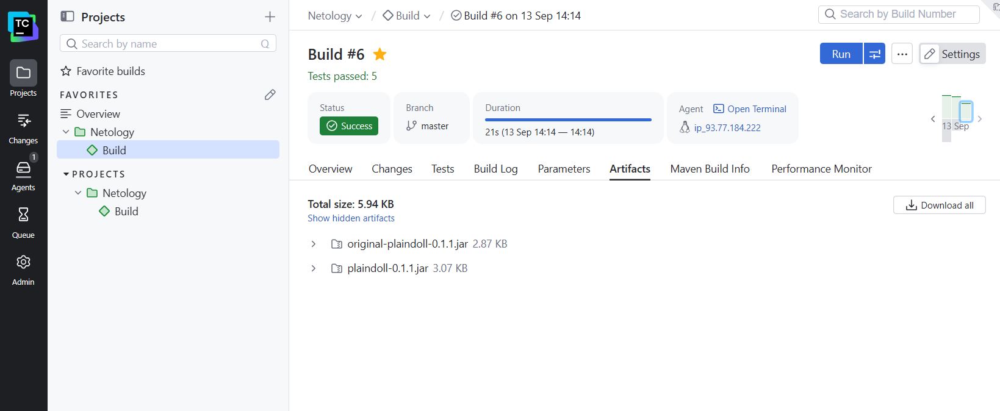
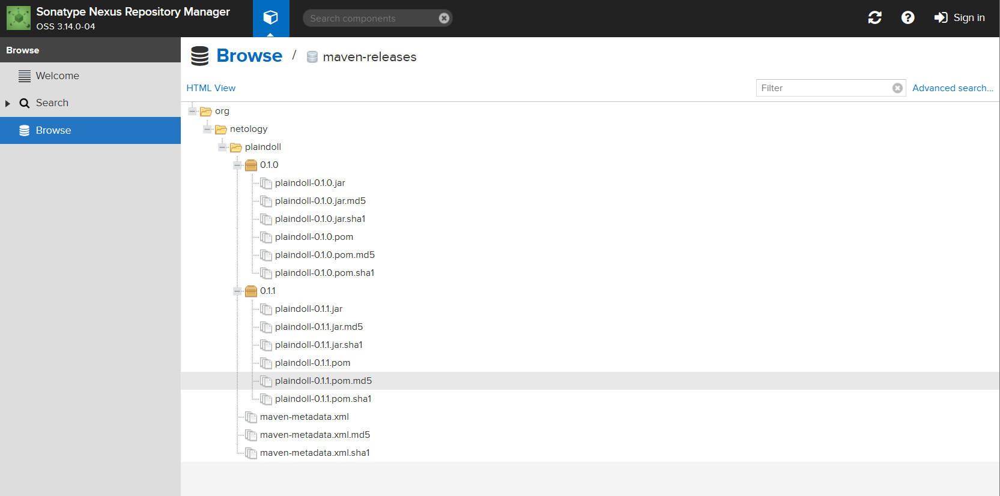

# Домашнее задание «TeamCity»

Репозиторий с решением: [bkotyrev/example-teamcity](https://github.com/bkotyrev/example-teamcity).

## Подготовка инфраструктуры

В Yandex Cloud созданы виртуальные машины `teamcity-server`, `teamcity-agent` и `nexus`.



Сделан fork исходного репозитория, запущен playbook из `infrastructure`.

## Проект TeamCity и Maven (пп. 1-8)

Автоопределение конфигурации не сработало, Maven сконфигурирован вручную. Первая сборка `master` завершилась успешно.



Настроены условия запуска:

- `master` - `clean deploy`;
- остальные ветки - `clean test`.

В поле **Goals** указаны `clean deploy` и `clean test` без префикса `mvn`, так как Maven Runner запускает Maven самостоятельно.

В корневом `pom.xml` указан адрес Nexus. Первая публикация `plaindoll:0.1.0` выполнена в репозиторий `maven-releases`.



## Правки кода приложения (пп. 9-14)

Создана ветка `feature/add_reply`. В класс `Welcomer` добавлен метод `sayGoodbye()` и поправлены тесты.

В `WelcomerTest` добавлена проверка результата метода на наличие `hunter`.



## Артефакты TeamCity и повторная сборка (пп. 15-18)

До настройки artifact paths в сборке `master` пользовательские артефакты отсутствовали.



В General Settings добавлено правило:

```text
target/*.jar
```

Версия приложения изменена на `0.1.1`. После повторной сборки `master` во вкладке **Artifacts** появились:

- `plaindoll-0.1.1.jar`;
- `original-plaindoll-0.1.1.jar`.




## Результат

Артефакты нескольких версий в Maven.


