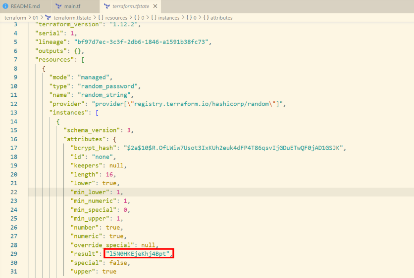
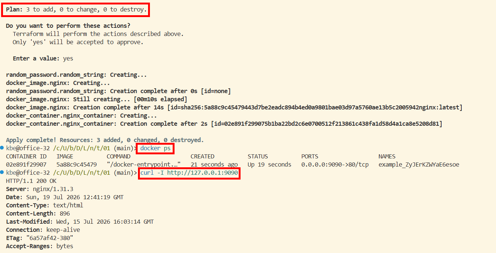
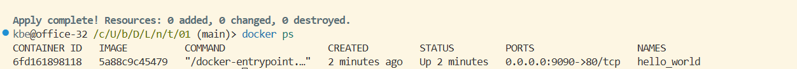
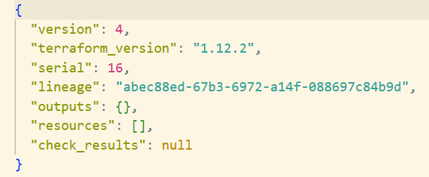

# Введение в Terraform

## Задание 1

1. Для скачивания зависимостей перемещаем `.terraformrc` файл в домашнюю папку пользователя и делаем затем `terraform init`.
2. В `.gitignore` на строке 12 обозначен файл секретов `personal.auto.tfvars`
3. Скриншот random_password в state-файле \
 
4. **Ошибка на строке 24** `resource "docker_image"` в том что не хватает имени ресурса, указан только тип: `Missing name for resource. All resource blocks must have 2 labels (type, name)`. **Ошибка-опечатка на строке 28** в том что имя ресурса не можен начинаться с цифры: `A name must start with a letter or underscore and may contain only letters, digits, underscores, and dashes.` **Ошибка на строке 30** в точ что указан не существующий ресурс `random_string_FAKE`.
5. ```shell
    terraform apply
    docker ps
    curl -I http://127.0.0.1:9090
   ```
   
6. . Опасность `auto-approve` в том что исключается ручная проверка и могут быть по ошибке удалены другие ресурсы, а пригодится может в CI/CD сценариях где не изначально не планируется вмешательство оператора.
7. ```shell
    terraform destroy
   ```
   
8. Удалению docker-образа `nginx:latest` мешает опция `keep_locally = true`, как об этом сказано в [документации](https://registry.terraform.io/providers/kreuzwerker/docker/latest/docs/resources/image#keep_locally-1)