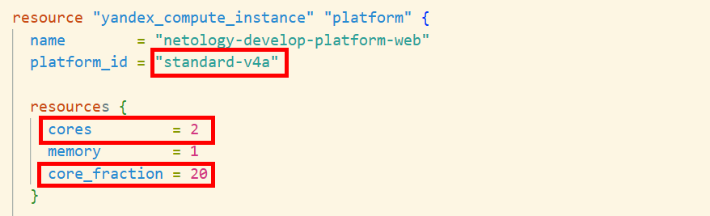
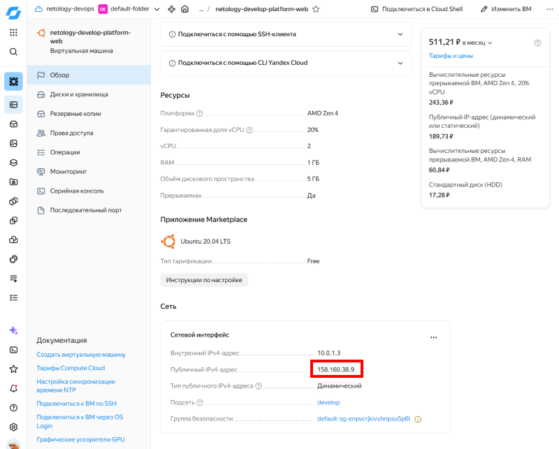
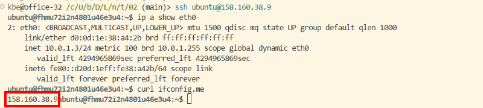
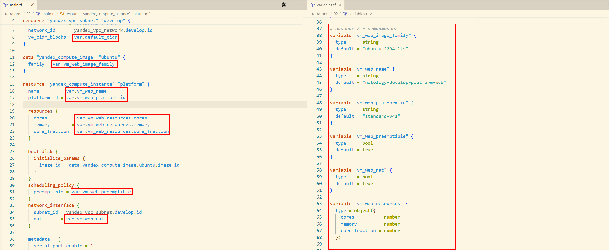
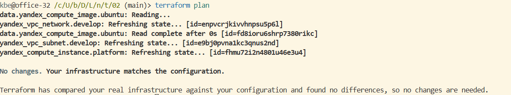
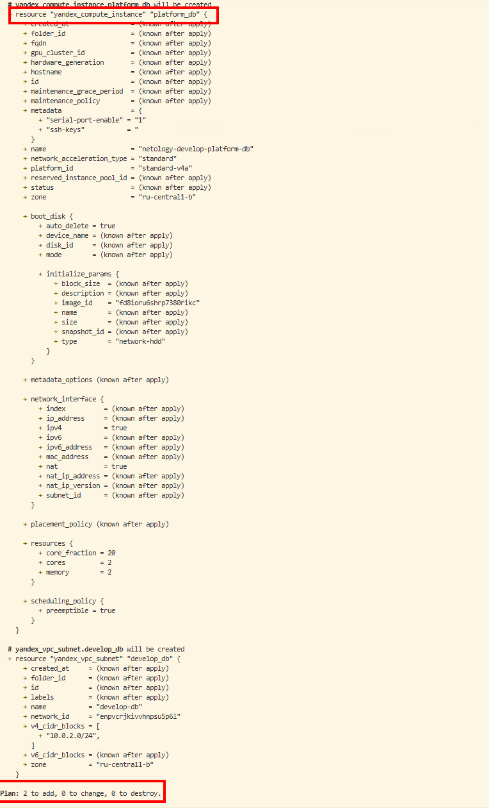
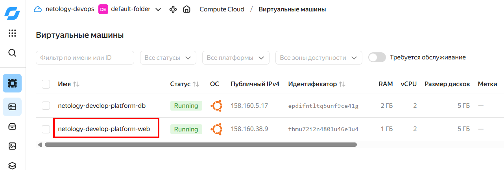
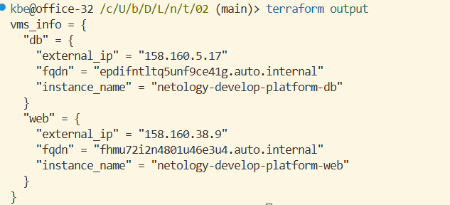
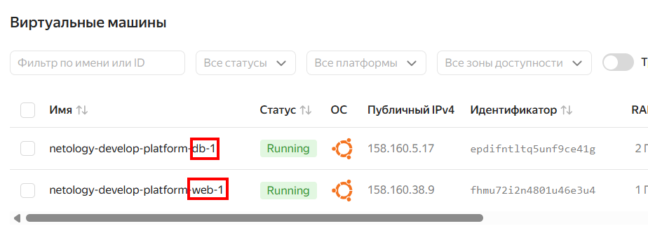

# Основы Terraform. Yandex Cloud

> [!NOTE]
> Облачные ресурсы удалены после выполения задания

## Задание 1

- **пп. 1-3**
    ```shell
    # получение cloud-id и folder-id
    yc config get cloud-id
    yc config get folder-id

    # создание сервисного аккаунта
    yc iam service-account create netology-terraform --folder-id <FOLDER_ID>

    # получение id сервисного аккаунта
    yc iam service-account get netology-terraform --folder-id <FOLDER_ID>

    # выдача прав сервисному аккаунту
    yc resource-manager folder add-access-binding <FOLDER_ID> --role admin --subject serviceAccount:<SERVICE_ACCOUNT_ID>

    # создание service_account_key_file
    yc iam key create --service-account-name netology-terraform --folder-id <FOLDER_ID> --output ~/.authorized_key.json
    chmod 600 ~/.authorized_key.json
    ```

---

- **пп. 4** <br>
  
  
  Исправлена опечатка в слове `standard`, а также платформа переименована в `standard-v4a` c корректными лимитами согласно [документации](https://yandex.cloud/ru/docs/compute/concepts/performance-levels).

---

- **п. 5** <br>
  ```shell
  # получение IP виртуальной машины из tfstate
  terraform state show yandex_compute_instance.platform | grep nat_ip_address
  
  # получение IP виртуальной машины через yc
  yc compute instance list

  # подключение к VM
  ssh ubuntu@158.160.38.9
  ```
  
  

--- 

- **п. 6** <br>
Параметр `preemptible = true` включает прерываемую VM, может быть остановлена облаком в любой момент после работы свыше суток.

Параметр `core_fraction = 5` задает гарантированную долю производительности vCPU 5%.

## Задание 2



## Задание 3



## Задание 4
[outputs.tf](outputs.tf)

```shell
terraform output
```



## Задание 5
[locals.tf](outputs.tf)

