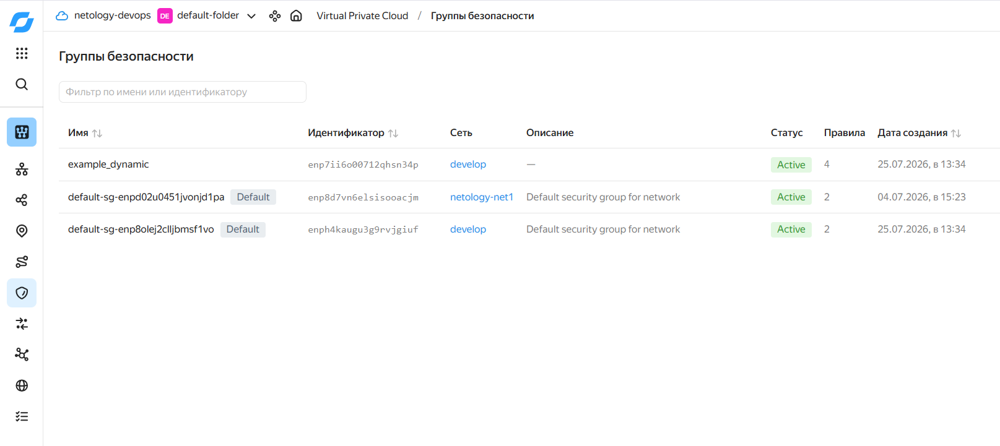
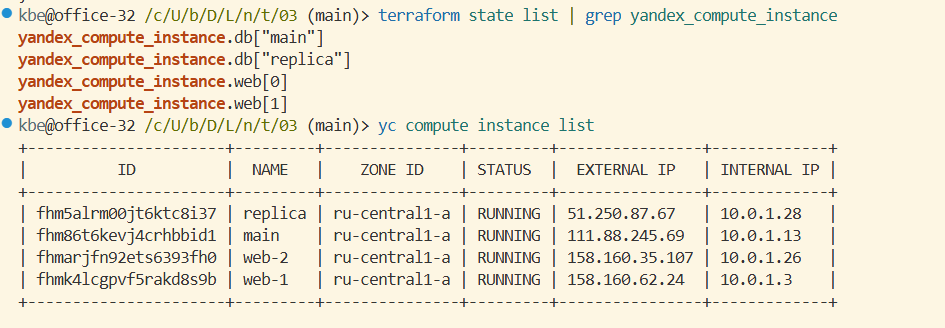
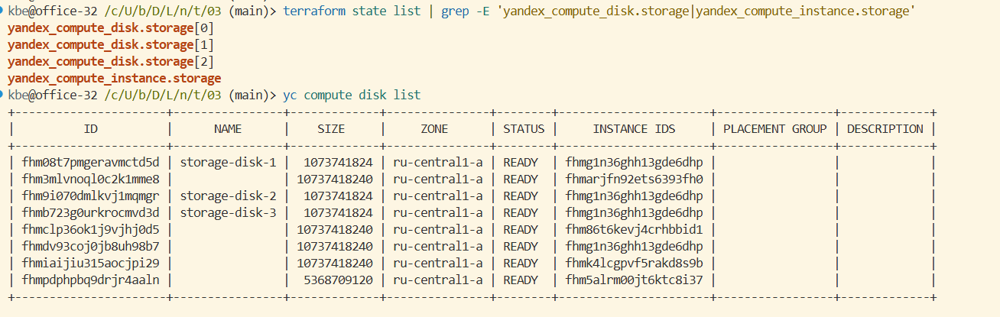
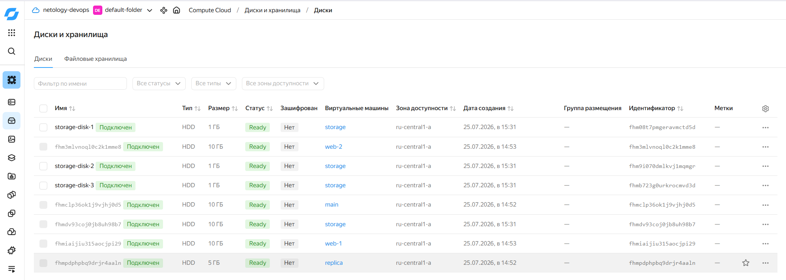
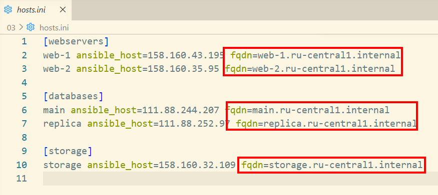
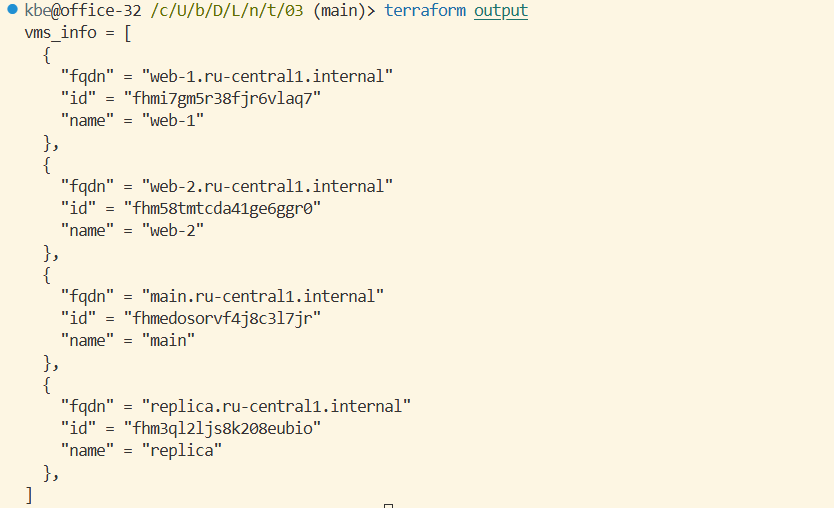
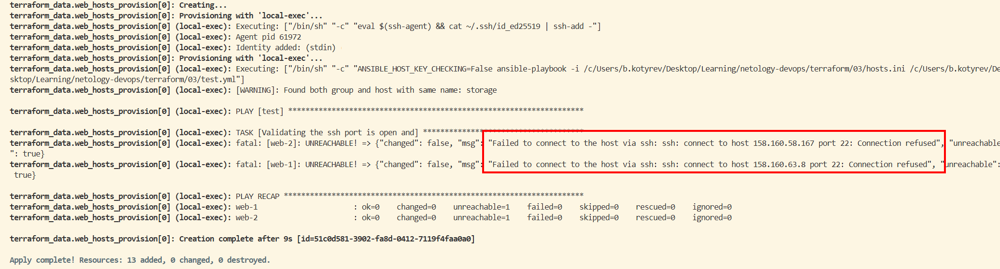
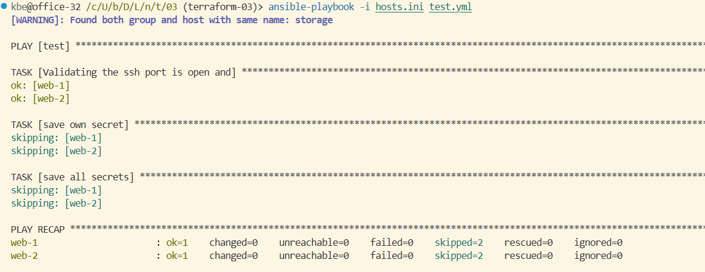
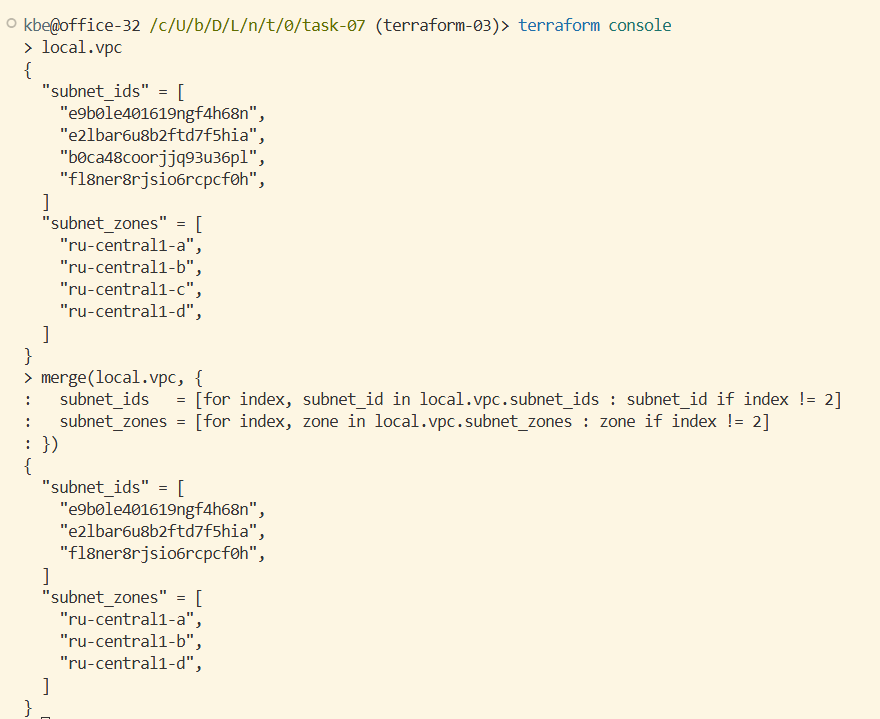
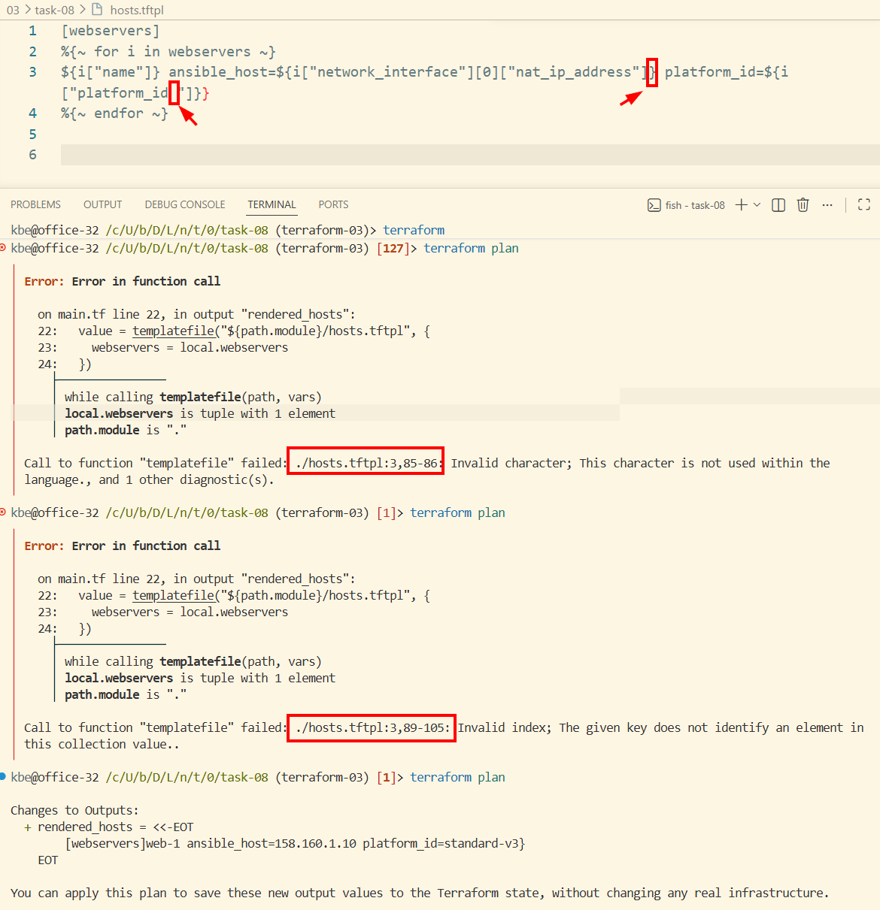

# Управляющие конструкции в коде Terraform

> [!NOTE]
> Облачные ресурсы удалены после выполения задания

## Задание 1

Вместо переменной `token` было решено использовать уже существующий ключ сервисного аккаунта `~/.authorized_key.json` - это безопаснее, поскольку файл находится вне папки проекта. И  позволяет использовать для команд `yс` и `terraform` единый способ аутентификации.

```shell
yc config set service-account-key ~/.authorized_key.json
```

А значение переменной `token` можно получить через вызов команды `yc iam create-token`.

```shell
yc iam create-token
```

### Список созданных групп безопасности


## Задание 2

```shell
terraform state list | grep yandex_compute_instance
yc compute instance list
```



## Задание 3

```shell
terraform state list | grep -E 'yandex_compute_disk.storage|yandex_compute_instance.storage'
yc compute disk list
```





## Задание 4

[hosts.ini](hosts.ini)




## Задание 5*

[outputs.tf](outputs.tf)



## Задание 6*

Как видно по скриншотам при запуске ansible из terraform хосты еще были недоступны. При запуске с задержкой вручную playbook отработал нормально. К сожалению, не было времени погрузиться глубже в отладку.





## Задание 7*

[задание 7](./task-07/)



По смыслу ближе всего ближе всего метод `slice()`, но с ним больше строк. `splice()` или `filter()` отсутствуют (привет JS ;-). ИИ подсказал лаконичный способ в духе Python list comprehension:

```hsl
merge(local.vpc, {
  subnet_ids   = [for index, subnet_id in local.vpc.subnet_ids : subnet_id if index != 2]
  subnet_zones = [for index, zone in local.vpc.subnet_zones : zone if index != 2]
})
```

## Задание 8*

[задание 8](./task-08/)

В шаблоне две ошибки:

1. Нет закрывающей скобки в интерполяции переменной `${i}`. При этом проверка реагирует на лишний пробел: "This character is not used within the language".
2. В ключе `platform_id` лишний пробел перед закрывающей кавычкой c ошибкой "Invalid index".

